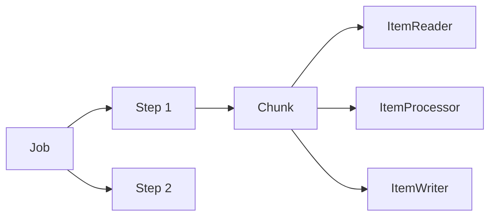

# Batch Processing — Spring Batch

## When Batch vs Streaming

| Batch | Streaming |
|-------|-----------|
| Process data at scheduled times | Process data as it arrives |
| Large datasets, bulk operations | Real-time, low latency |
| End-to-end processing time matters | Individual event latency matters |
| Monthly reports, data migration | Live feeds, event-driven updates |

## Spring Batch Concepts



A **Job** contains **Steps**. Each step reads items in **chunks** (reader → processor → writer). Spring Batch tracks job execution in a metadata database, enabling restartability.

## Step 1: Add Dependencies

```xml
<dependency>
    <groupId>org.springframework.boot</groupId>
    <artifactId>spring-boot-starter-batch</artifactId>
</dependency>
```

## Step 2: Define the Job

```java
@Configuration
@RequiredArgsConstructor
public class ProductImportJobConfig {
    private final JobRepository jobRepository;
    private final PlatformTransactionManager transactionManager;

    @Bean
    public Job productImportJob(Step importStep) {
        return new JobBuilder("productImportJob", jobRepository)
            .incrementer(new RunIdIncrementer())
            .start(importStep)
            .listener(jobCompletionListener())
            .build();
    }

    @Bean
    public Step importStep(
            ItemReader<ProductCsv> reader,
            ItemProcessor<ProductCsv, Product> processor,
            ItemWriter<Product> writer) {
        return new StepBuilder("importStep", jobRepository)
            .<ProductCsv, Product>chunk(100, transactionManager)
            .reader(reader)
            .processor(processor)
            .writer(writer)
            .faultTolerant()
            .retryLimit(3)
            .retry(TransientDataAccessException.class)
            .skipLimit(10)
            .skip(ParseException.class)
            .listener(stepExecutionListener())
            .build();
    }
}
```

## Step 3: Reader, Processor, Writer

```java
@Bean
@StepScope
public FlatFileItemReader<ProductCsv> reader(
        @Value("#{jobParameters['inputFile']}") String inputFile) {
    return new FlatFileItemReaderBuilder<ProductCsv>()
        .name("productReader")
        .resource(new FileSystemResource(inputFile))
        .delimited()
        .delimiter(",")
        .names("name", "price", "category")
        .fieldSetMapper(fieldSet -> new ProductCsv(
            fieldSet.readString("name"),
            fieldSet.readBigDecimal("price"),
            fieldSet.readString("category")))
        .linesToSkip(1)
        .build();
}

@Component
public class ProductProcessor implements ItemProcessor<ProductCsv, Product> {
    @Override
    public Product process(ProductCsv csv) {
        if (csv.price().compareTo(BigDecimal.ZERO) <= 0) {
            return null; // null means skip this item
        }
        var product = new Product();
        product.setName(csv.name().trim().toUpperCase());
        product.setPrice(csv.price());
        product.setCategory(csv.category());
        return product;
    }
}

@Component
@RequiredArgsConstructor
public class ProductWriter implements ItemWriter<Product> {
    private final ProductRepository repository;

    @Override
    public void write(List<? extends Product> items) {
        repository.saveAll(items);
    }
}
```

## Step 4: Launch the Job

```java
@RestController
@RequiredArgsConstructor
public class JobController {
    private final JobLauncher jobLauncher;
    private final Job productImportJob;

    @PostMapping("/jobs/import")
    public ResponseEntity<String> runImport(
            @RequestParam String inputFile) throws Exception {
        var params = new JobParametersBuilder()
            .addString("inputFile", inputFile)
            .addLong("timestamp", System.currentTimeMillis())
            .toJobParameters();
        var execution = jobLauncher.run(productImportJob, params);
        return ResponseEntity.ok("Job started: " + execution.getStatus());
    }
}
```

## Key Points

- **Chunk size** (100 above) controls memory vs throughput tradeoff. Larger chunks = fewer DB round trips but more memory.
- **JobParameters** must be unique for each run. `RunIdIncrementer` handles this automatically.
- **Restartability**: If a job fails at chunk 500, it resumes from there on restart — Spring Batch tracks position in the metadata tables.
- **faultTolerant()** lets you configure retry and skip logic per exception type.
- Return `null` from the processor to filter items without failing the job.
