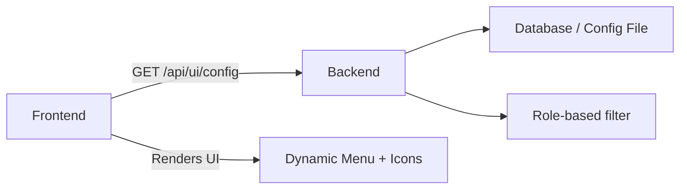

# Icon and UI Management — Backend-Driven Frontend Config

## Why the Backend Controls UI

Hardcoded frontend configurations create deployment dependencies. When menus, icons, or feature flags change, you redeploy the frontend. Instead, serve UI configuration from the backend — change config without a frontend release.

## The Architecture



## Step 1: Configuration Model

```java
public record UiConfig(
    List<MenuGroup> menus,
    Map<String, FeatureFlag> features,
    Map<String, String> theme
) {}

public record MenuGroup(
    String id,
    String label,
    String icon,
    int order,
    List<MenuItem> items
) {}

public record MenuItem(
    String id,
    String label,
    String icon,
    String route,
    Set<String> requiredRoles,
    boolean enabled
) {}

public record FeatureFlag(
    boolean enabled,
    String description,
    Map<String, Boolean> rollout
) {}
```

## Step 2: Service Layer

```java
@Service
@RequiredArgsConstructor
public class UiConfigService {
    private final MenuRepository menuRepository;
    private final FeatureFlagRepository featureFlagRepository;

    @Cacheable(value = "ui-config", key = "#roleSet.hashCode()")
    public UiConfig getConfig(Set<String> userRoles, String appVersion) {
        var allMenus = menuRepository.findAllByOrderByOrderAsc();
        var filteredMenus = allMenus.stream()
            .map(group -> filterMenuByRoles(group, userRoles))
            .filter(Optional::isPresent)
            .map(Optional::get)
            .toList();

        var flags = featureFlagRepository.findAll().stream()
            .collect(Collectors.toMap(
                FeatureFlag::getKey,
                flag -> new FeatureFlag(
                    flag.isEnabled(),
                    flag.getDescription(),
                    flag.getRollout())));

        var theme = Map.of(
            "primaryColor", "#2563eb",
            "logoUrl", "/assets/logo.svg",
            "faviconUrl", "/assets/favicon.ico"
        );

        return new UiConfig(filteredMenus, flags, theme);
    }

    private Optional<MenuGroup> filterMenuByRoles(
            MenuGroup group, Set<String> userRoles) {
        var accessibleItems = group.items().stream()
            .filter(item -> item.enabled())
            .filter(item -> userRoles.stream()
                .anyMatch(item.requiredRoles()::contains))
            .toList();
        if (accessibleItems.isEmpty()) return Optional.empty();
        return Optional.of(new MenuGroup(
            group.id(), group.label(), group.icon(),
            group.order(), accessibleItems));
    }
}
```

## Step 3: Controller

```java
@RestController
@RequestMapping("/api/ui")
@RequiredArgsConstructor
public class UiConfigController {
    private final UiConfigService service;

    @GetMapping("/config")
    public ResponseEntity<UiConfig> getConfig(
            @AuthenticationPrincipal Jwt jwt) {
        var roles = extractRoles(jwt);
        var config = service.getConfig(roles, "1.0");
        return ResponseEntity.ok()
            .cacheControl(CacheControl.maxAge(5, TimeUnit.MINUTES))
            .body(config);
    }

    @GetMapping("/config/{version}")
    public ResponseEntity<UiConfig> getConfigForVersion(
            @PathVariable String version,
            @AuthenticationPrincipal Jwt jwt) {
        var roles = extractRoles(jwt);
        var config = service.getConfig(roles, version);
        return ResponseEntity.ok(config);
    }

    private Set<String> extractRoles(Jwt jwt) {
        var roles = jwt.getClaimAsStringList("roles");
        return roles != null ? new HashSet<>(roles) : Set.of("USER");
    }
}
```

## Example JSON Response

```json
{
  "menus": [
    {
      "id": "catalog",
      "label": "Catalog",
      "icon": "inventory_2",
      "order": 1,
      "items": [
        {
          "id": "products",
          "label": "Products",
          "icon": "shopping_bag",
          "route": "/products",
          "requiredRoles": ["ADMIN", "MANAGER"],
          "enabled": true
        }
      ]
    }
  ],
  "features": {
    "dark-mode": {
      "enabled": true,
      "description": "Dark theme toggle",
      "rollout": {"android": true, "ios": false}
    }
  },
  "theme": {
    "primaryColor": "#2563eb",
    "logoUrl": "/assets/logo.svg"
  }
}
```

## Key Points

- Cache the config response — it rarely changes per user role
- Filter menus by role on the backend — never trust the frontend to hide things
- Version the config so different app versions get appropriate settings
- Feature flags let you enable/disable features without deploying
- Icons use string identifiers (Material Icons, SVG references) — not image files
