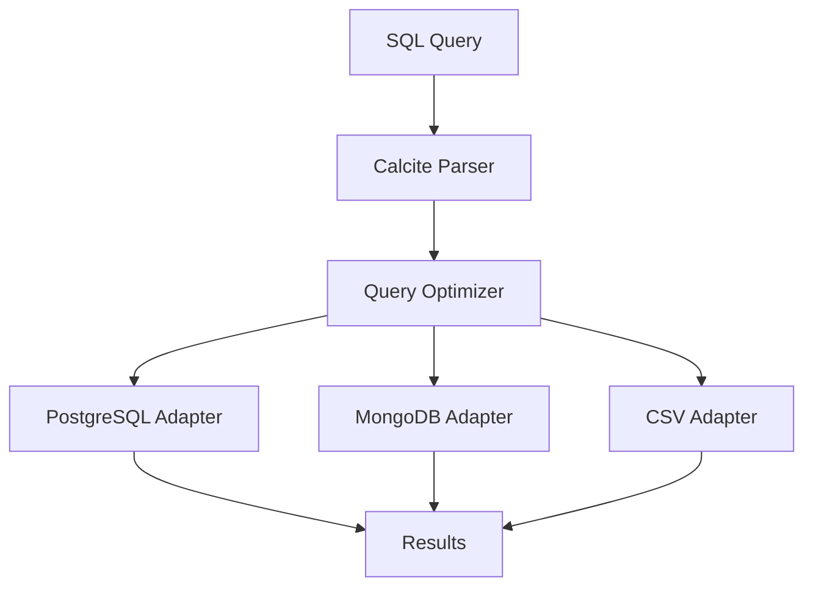

# Data Management Platform — Apache Calcite for Query Federation

> **Last verified:** June 2026 — Calcite 1.36.0

## The Problem

Your data lives in multiple places: PostgreSQL for transactions, MongoDB for documents, CSV files from partners, Elasticsearch for search. Joining across these sources means ETL pipelines or data duplication.

Apache Calcite lets you write SQL queries that span multiple data sources.

## What Calcite Does

Calcite is a SQL parser and query engine. It does not store data. It translates SQL into optimized query plans that execute against your actual data sources.

> **Diagram:** SQL query parsed by Calcite, optimized, then routed through PostgreSQL, MongoDB, or CSV adapters to return federated results.



## When Calcite Helps

| Scenario | Why Calcite |
|----------|-------------|
| Query across PostgreSQL + MongoDB | Single SQL for both |
| Analyze CSV + database together | No import needed |
| Cross-source JOINs | Calcite pushes down what it can |
| Build a custom query engine | SQL parsing for free |

## Step 1: Add Calcite Dependency

```xml
<dependency>
    <groupId>org.apache.calcite</groupId>
    <artifactId>calcite-core</artifactId>
    <version>1.36.0</version>
</dependency>
```

## Step 2: CSV Adapter — Query Files with SQL

```java
@Service
public class CalciteCsvService {
    public List<Map<String, Object>> queryCsv(String sql) throws SQLException {
        var schema = Frameworks.createRootSchema(true);
        var csvDir = new File("data/");
        schema.add("orders",
            new CsvTableFactory().create(
                schema, "orders",
                Map.of("file", new File(csvDir, "orders.csv").getAbsolutePath()),
                null));

        var config = Frameworks.createConfigBuilder()
            .defaultSchema(schema)
            .build();

        try (var connection = DriverManager.getConnection("jdbc:calcite:");
             var statement = connection.createStatement()) {
            var factory = JdbcSchema.createDataSource();
            var resultSet = statement.executeQuery(sql);
            return mapResults(resultSet);
        }
    }

    private List<Map<String, Object>> mapResults(ResultSet rs) throws SQLException {
        var meta = rs.getMetaData();
        var columns = meta.getColumnCount();
        var results = new ArrayList<Map<String, Object>>();
        while (rs.next()) {
            var row = new LinkedHashMap<String, Object>();
            for (int i = 1; i <= columns; i++) {
                row.put(meta.getColumnLabel(i), rs.getObject(i));
            }
            results.add(row);
        }
        return results;
    }
}
```

## Step 3: JDBC Adapter — Query Multiple Databases

```java
@Configuration
public class CalciteConfig {
    @Bean
    public Schema federatedSchema(
            @Value("${spring.datasource.url}") String pgUrl,
            @Value("${mongo.uri}") String mongoUri) {
        var rootSchema =Frameworks.createRootSchema(true);

        var pgDataSource = new SimpleDataSource();
        pgDataSource.setUrl(pgUrl);
        rootSchema.add("pg",
            JdbcSchema.create(rootSchema, "pg", pgDataSource, null, "public"));

        rootSchema.add("mongo",
            new MongoSchemaFactory().create(
                rootSchema, "mongo",
                Map.of("host", "localhost", "database", "analytics")));

        return rootSchema;
    }
}
```

## Step 4: Cross-Source JOIN

```java
@Service
@RequiredArgsConstructor
public class FederatedQueryService {
    private final Schema federatedSchema;

    public List<Map<String, Object>> execute(String sql) throws SQLException {
        var properties = new Properties();
        properties.setProperty("lex", "MYSQL");
        try (var connection = DriverManager.getConnection(
                "jdbc:calcite:", properties)) {
            var calciteConnection = connection.unwrap(CalciteConnection.class);
            calciteConnection.getRootSchema().add("app", federatedSchema);

            try (var stmt = connection.createStatement();
                 var rs = stmt.executeQuery(sql)) {
                return mapResults(rs);
            }
        }
    }
}
```

```sql
-- Join PostgreSQL users with MongoDB analytics events
SELECT u.name, COUNT(e.event_id) as event_count
FROM pg.users u
JOIN mongo.events e ON u.id = e.user_id
GROUP BY u.name
ORDER BY event_count DESC
```

## Key Points

- Calcite is a query engine, not a database — it needs adapters for your data sources
- Query pushdown: Calcite sends `WHERE` and `JOIN` clauses to the source DB when possible
- Use it for ad-hoc analytics across sources, not as a replacement for proper ETL
- The CSV adapter is the easiest way to start — query flat files with SQL immediately
- For production, consider pre-built alternatives like Trino (formerly Presto) which uses Calcite internally
