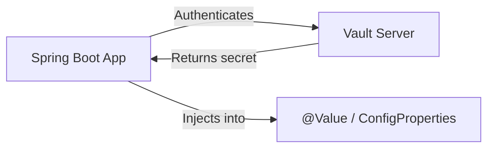

# Vault Injection — Secrets Management with Spring Cloud Vault

> **Last verified:** June 2026 — Spring Cloud Vault 4.1.0

## Why Vault

Secrets in environment variables or config files are visible in process lists, CI logs, and container inspections. HashiCorp Vault stores secrets centrally, controls access with policies, and rotates credentials automatically.

## How It Works

> **Diagram:** Spring Boot application authenticates with a Vault Server, receives secrets, and injects them into @Value or ConfigProperties fields.



## Step 1: Add Dependencies

```xml
<dependency>
    <groupId>org.springframework.cloud</groupId>
    <artifactId>spring-cloud-starter-vault-config</artifactId>
</dependency>
```

```xml
<dependencyManagement>
    <dependencies>
        <dependency>
            <groupId>org.springframework.cloud</groupId>
            <artifactId>spring-cloud-vault</artifactId>
            <version>4.1.0</version>
            <type>pom</type>
            <scope>import</scope>
        </dependency>
    </dependencies>
</dependencyManagement>
```

## Step 2: Configure Vault Connection

```yaml
# application.yml
spring:
  cloud:
    vault:
      uri: https://vault.example.com:8200
      authentication: TOKEN
      token: ${VAULT_TOKEN}
      kv:
        enabled: true
        backend: secret
        application-name: product-service
```

Vault authenticates your app using a token (dev), Kubernetes service account, AppRole, or TLS certificates. For production, use AppRole:

```yaml
spring:
  cloud:
    vault:
      authentication: APPROLE
      app-role:
        role-id: ${VAULT_ROLE_ID}
        secret-id: ${VAULT_SECRET_ID}
```

## Step 3: Store a Secret in Vault

```bash
# Write a database password to Vault
vault kv put secret/product-service/database \
  username=dbuser \
  password=s3cure-p@ssw0rd \
  url=jdbc:postgresql://db.internal:5432/products
```

## Step 4: Inject Secrets into Your App

Vault secrets are injected like regular properties. Spring resolves `${...}` from Vault transparently.

```yaml
# application.yml — reference Vault secrets
spring:
  datasource:
    url: ${database.url}
    username: ${database.username}
    password: ${database.password}
```

The keys `database.url`, `database.username`, `database.password` come from Vault's `secret/product-service/database` path.

## Step 5: Dynamic Database Credentials

Vault can generate temporary database credentials instead of static passwords:

```yaml
spring:
  cloud:
    vault:
      database:
        enabled: true
        role: product-service-readonly
        backend: database

  datasource:
    url: ${spring.cloud.vault.database.url}
    username: ${spring.cloud.vault.database.username}
    password: ${spring.cloud.vault.database.password}
```

Vault creates a database user with a TTL, revokes it when the lease expires. No static credentials anywhere.

## Step 6: Refresh Secrets at Runtime

```java
@RestController
@RefreshScope
@RequiredArgsConstructor
public class SecretController {
    @Value("${api.secret-key}")
    private String secretKey;

    @GetMapping("/api/key-info")
    public String getKeyInfo() {
        return "Key prefix: " + secretKey.substring(0, 8) + "...";
    }
}
```

```bash
# Trigger a refresh without restarting
curl -X POST http://localhost:8080/actuator/refresh
```

## Secret Engine Types

| Engine | Use Case |
|--------|----------|
| KV (Key-Value) | Static secrets (API keys, passwords) |
| Database | Dynamic DB credentials with TTL |
| PKI | TLS certificate generation |
| Transit | Encryption as a service |

## Key Points

- Never put secrets in code or environment variables in production
- Use AppRole authentication for apps — tokens are for dev only
- Dynamic credentials rotate automatically — no manual password changes
- `@RefreshScope` lets you rotate secrets without restarting the app
- Vault audit logs every secret access for compliance
