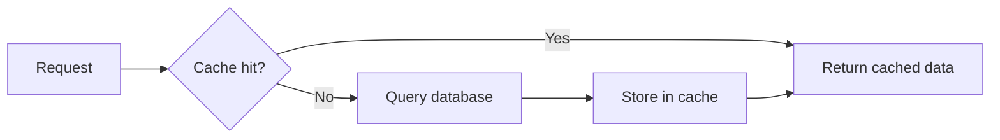

# Caching — Reduce DB Load, Speed Up Responses

## Why Cache

Every database query costs time and resources. If the same data is read frequently and rarely changes, cache it. A cache hit returns in microseconds; a DB round trip takes milliseconds.

## Cache Aside Pattern



Your application checks the cache first. On a miss, it queries the database and stores the result in cache for next time.

## Step 1: Enable Caching

```java
@Configuration
@EnableCaching
public class CacheConfig {
    @Bean
    public RedisCacheManager cacheManager(RedisConnectionFactory factory) {
        var config = RedisCacheConfiguration.defaultCacheConfig()
            .entryTtl(Duration.ofMinutes(10))
            .serializeValuesWith(RedisSerializationContext
                .SerializationPair
                .fromSerializer(new GenericJackson2JsonRedisSerializer()));
        return RedisCacheManager.builder(factory)
            .cacheDefaults(config)
            .build();
    }
}
```

```xml
<dependency>
    <groupId>org.springframework.boot</groupId>
    <artifactId>spring-boot-starter-data-redis</artifactId>
</dependency>
```

```yaml
spring:
  data:
    redis:
      host: localhost
      port: 6379
```

## Step 2: @Cacheable — Read from Cache

```java
@Service
@RequiredArgsConstructor
public class UserService {
    private final UserRepository repository;

    @Cacheable(value = "users", key = "#id")
    public UserResponse getUser(Long id) {
        var user = repository.findById(id)
            .orElseThrow(() -> new ResourceNotFoundException("User not found"));
        return new UserResponse(user.getId(), user.getName(), user.getEmail());
    }

    @Cacheable(value = "user-profiles", key = "#username")
    public UserProfile getProfile(String username) {
        return repository.findProfileByUsername(username);
    }
}
```

On first call, the method executes and the result is cached. On subsequent calls with the same key, the cached value is returned — the method body is not executed.

## Step 3: @CachePut — Update Cache

```java
@CachePut(value = "users", key = "#result.id")
public UserResponse updateUser(Long id, UserRequest request) {
    var user = repository.findById(id)
        .orElseThrow(() -> new ResourceNotFoundException("User not found"));
    user.setName(request.name());
    user.setEmail(request.email());
    var saved = repository.save(user);
    return new UserResponse(saved.getId(), saved.getName(), saved.getEmail());
}
```

`@CachePut` always executes the method and updates the cache with the result. Use it after updates to keep cache and database in sync.

## Step 4: @CacheEvict — Remove from Cache

```java
@CacheEvict(value = "users", key = "#id")
public void deleteUser(Long id) {
    repository.deleteById(id);
}

@CacheEvict(value = "users", allEntries = true)
public void evictAllUsers() {
    // Used after bulk updates or data migrations
}
```

## Step 5: TTL and Cache Configuration

```java
@Configuration
@EnableCaching
public class CacheConfig {
    @Bean
    public RedisCacheManager cacheManager(RedisConnectionFactory factory) {
        var userConfig = RedisCacheConfiguration.defaultCacheConfig()
            .entryTtl(Duration.ofMinutes(30));

        var profileConfig = RedisCacheConfiguration.defaultCacheConfig()
            .entryTtl(Duration.ofHours(2));

        return RedisCacheManager.builder(factory)
            .withCacheConfiguration("users", userConfig)
            .withCacheConfiguration("user-profiles", profileConfig)
            .build();
    }
}
```

## When Not to Cache

- Data changes frequently (real-time counters, stock prices)
- Data is unique per request (search results with different filters)
- The dataset is larger than available cache memory

## Key Points

- Start with `@Cacheable` on expensive queries — measure the impact
- Set a TTL — stale data is worse than no cache
- Use `@CachePut` after writes to keep cache warm
- Redis is the production standard; Caffeine is great for single-instance caching
- Cache keys must be unique — use SpEL expressions like `#id` or `#user.name()`
