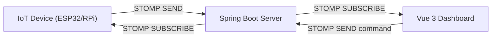

# WebSocket — Real-Time IoT Device ↔ Dashboard with Spring Boot + Vue 3

## Why WebSocket

HTTP is request-response. IoT devices push telemetry continuously — temperature, humidity, GPS, battery. Polling wastes bandwidth and adds latency. WebSocket keeps a single persistent connection open: devices push readings, server broadcasts to dashboards, dashboards send commands back to devices — all in real-time.

> **Diagram:** Bidirectional STOMP communication between IoT Device, Spring Boot Server, and Vue 3 Dashboard — devices send telemetry, server broadcasts to dashboard, and dashboard sends commands back.



## WebSocket vs SSE vs Long Polling

| Approach | Direction | Use Case |
|----------|-----------|----------|
| WebSocket | Bidirectional | IoT telemetry, chat, live collaboration |
| SSE | Server → Client only | Live scores, notifications |
| Long polling | Client → Server (hacky) | Legacy fallback |

## Architecture

- **IoT Device** → sends telemetry every N seconds via STOMP
- **Spring Boot** → validates, enriches, broadcasts to topic subscribers, stores to DB
- **Vue 3 Dashboard** → subscribes to device topics, renders live charts, sends commands
- **Commands** → dashboard sends threshold/alert configs back to specific devices

## Step 1: Add Dependencies

```xml
<dependency>
    <groupId>org.springframework.boot</groupId>
    <artifactId>spring-boot-starter-websocket</artifactId>
</dependency>
```

## Step 2: WebSocket Configuration

```java
@Configuration
@EnableWebSocketMessageBroker
public class WebSocketConfig implements WebSocketMessageBrokerConfigurer {
    @Override
    public void configureMessageBroker(MessageBrokerRegistry config) {
        config.enableSimpleBroker("/topic", "/queue");
        config.setApplicationDestinationPrefixes("/app");
        config.setUserDestinationPrefix("/user");
    }

    @Override
    public void registerStompEndpoints(StompEndpointRegistry registry) {
        registry.addEndpoint("/ws")
            .setAllowedOriginPatterns("*")
            .withSockJS();
    }
}
```

STOMP adds subscription semantics over raw WebSocket. Clients subscribe to topics, server broadcasts to subscribers. SockJS provides fallback transports when WebSocket is blocked.

## Step 3: Message Models

```java
public record DeviceTelemetry(
    String deviceId,
    String sensorType,
    double value,
    String unit,
    Instant timestamp
) {}

public record DeviceCommand(
    String deviceId,
    String command,
    Map<String, Object> params
) {}

public record DeviceAlert(
    String deviceId,
    String severity,
    String message,
    Instant timestamp
) {}
```

## Step 4: Device Simulator (IoT → Server)

IoT devices use lightweight STOMP clients. Here's a Java-based device simulator you can run independently:

```java
@Component
@Scheduled(fixedRate = 3000)
@RequiredArgsConstructor
public class DeviceSimulator {
    private final SimpMessagingTemplate ws;
    private final Random random = new Random();

    private static final List<String> DEVICES = List.of("esp32-001", "esp32-002", "rpi-003");
    private static final List<String> SENSORS = List.of("temperature", "humidity", "pressure");

    @Scheduled(fixedRate = 3000)
    public void pushTelemetry() {
        for (String deviceId : DEVICES) {
            var sensor = SENSORS.get(random.nextInt(SENSORS.size()));
            var value = generateValue(sensor);
            var telemetry = new DeviceTelemetry(
                deviceId, sensor, value, unitFor(sensor), Instant.now());
            ws.convertAndSend("/topic/devices/" + deviceId + "/telemetry", telemetry);
        }
    }

    private double generateValue(String sensor) {
        return switch (sensor) {
            case "temperature" -> 20 + random.nextDouble() * 15;
            case "humidity" -> 40 + random.nextDouble() * 30;
            case "pressure" -> 990 + random.nextDouble() * 30;
            default -> random.nextDouble() * 100;
        };
    }

    private String unitFor(String sensor) {
        return switch (sensor) {
            case "temperature" -> "°C";
            case "humidity" -> "%";
            case "pressure" -> "hPa";
            default -> "";
        };
    }
}
```

## Step 5: Alert Engine (Server → Dashboard)

Server-side logic that monitors telemetry and pushes alerts when thresholds are exceeded:

```java
@Controller
@RequiredArgsConstructor
public class DeviceController {
    private final SimpMessagingTemplate ws;
    private final Map<String, Double> thresholds = new ConcurrentHashMap<>();

    @MessageMapping("/devices/{deviceId}/telemetry")
    public void handleTelemetry(@DestinationVariable String deviceId,
            DeviceTelemetry telemetry) {
        ws.convertAndSend("/topic/devices/" + deviceId + "/telemetry", telemetry);

        var limit = thresholds.get(deviceId + ":" + telemetry.sensorType());
        if (limit != null && telemetry.value() > limit) {
            var alert = new DeviceAlert(deviceId, "HIGH",
                telemetry.sensorType() + " exceeded threshold: "
                    + telemetry.value() + " " + telemetry.unit(),
                Instant.now());
            ws.convertAndSend("/topic/devices/" + deviceId + "/alerts", alert);
        }
    }

    @MessageMapping("/devices/{deviceId}/threshold")
    public void setThreshold(@DestinationVariable String deviceId,
            Map<String, Object> payload) {
        var sensor = (String) payload.get("sensor");
        var value = ((Number) payload.get("value")).doubleValue();
        thresholds.put(deviceId + ":" + sensor, value);
        ws.convertAndSend("/topic/devices/" + deviceId + "/thresholds",
            Map.of("sensor", sensor, "threshold", value));
    }
}
```

## Step 6: Command Endpoint (Dashboard → Device)

```java
@Controller
@RequiredArgsConstructor
public class DeviceCommandController {
    private final SimpMessagingTemplate ws;

    @MessageMapping("/devices/{deviceId}/command")
    public void sendCommand(@DestinationVariable String deviceId,
            DeviceCommand command) {
        ws.convertAndSend("/topic/devices/" + deviceId + "/commands", command);
    }
}
```

## Step 7: Vue 3 Dashboard — Composable

```typescript
// composables/useDeviceWebSocket.ts
import { ref, onMounted, onUnmounted } from 'vue'
import SockJS from 'sockjs-client'
import { Client, IMessage } from '@stomp/stompjs'

export interface Telemetry {
  deviceId: string
  sensorType: string
  value: number
  unit: string
  timestamp: string
}

export interface Alert {
  deviceId: string
  severity: string
  message: string
  timestamp: string
}

export interface Command {
  deviceId: string
  command: string
  params: Record<string, unknown>
}

export function useDeviceWebSocket(deviceId: string) {
  const telemetry = ref<Telemetry[]>([])
  const alerts = ref<Alert[]>([])
  const connected = ref(false)
  let stompClient: Client | null = null

  onMounted(() => {
    stompClient = new Client({
      webSocketFactory: () => new SockJS('http://localhost:8080/ws'),
      reconnectDelay: 5000,
      onConnect: () => {
        connected.value = true

        stompClient!.subscribe(
          `/topic/devices/${deviceId}/telemetry`,
          (msg: IMessage) => {
            const data: Telemetry = JSON.parse(msg.body)
            telemetry.value = [...telemetry.value.slice(-99), data]
          }
        )

        stompClient!.subscribe(
          `/topic/devices/${deviceId}/alerts`,
          (msg: IMessage) => {
            alerts.value = [JSON.parse(msg.body), ...alerts.value.slice(0, 49)]
          }
        )

        stompClient!.subscribe(
          `/topic/devices/${deviceId}/commands`,
          (msg: IMessage) => {
            console.log('Command ack:', JSON.parse(msg.body))
          }
        )
      },
      onDisconnect: () => { connected.value = false },
    })
    stompClient.activate()
  })

  function sendCommand(command: string, params: Record<string, unknown> = {}) {
    stompClient?.publish({
      destination: `/app/devices/${deviceId}/command`,
      body: JSON.stringify({ deviceId, command, params }),
    })
  }

  function setThreshold(sensor: string, value: number) {
    stompClient?.publish({
      destination: `/app/devices/${deviceId}/threshold`,
      body: JSON.stringify({ sensor, value }),
    })
  }

  onUnmounted(() => stompClient?.deactivate())

  return { telemetry, alerts, connected, sendCommand, setThreshold }
}
```

## Step 8: Vue 3 Dashboard — Component

```vue
<!-- DeviceDashboard.vue -->
<script setup lang="ts">
import { computed } from 'vue'
import { useDeviceWebSocket } from '../composables/useDeviceWebSocket'

const props = defineProps<{ deviceId: string }>()

const { telemetry, alerts, connected, sendCommand, setThreshold } =
  useDeviceWebSocket(props.deviceId)

const latestTemp = computed(() =>
  telemetry.value
    .filter(t => t.sensorType === 'temperature')
    .at(-1)
)

function reboot() {
  sendCommand('reboot', { delay: 5 })
}

function setTempLimit() {
  setThreshold('temperature', 30)
}
</script>

<template>
  <div class="dashboard">
    <header>
      <h2>{{ deviceId }}</h2>
      <span :class="['status', connected ? 'online' : 'offline']">
        {{ connected ? 'LIVE' : 'DISCONNECTED' }}
      </span>
    </header>

    <section class="current">
      <h3>Current Reading</h3>
      <div v-if="latestTemp" class="reading">
        {{ latestTemp.value.toFixed(1) }} {{ latestTemp.unit }}
      </div>
      <div v-else>Waiting for data...</div>
    </section>

    <section class="history">
      <h3>Telemetry History</h3>
      <ul>
        <li v-for="t in telemetry.slice(-10)" :key="t.timestamp">
          [{{ t.sensorType }}] {{ t.value.toFixed(1) }} {{ t.unit }}
          — {{ new Date(t.timestamp).toLocaleTimeString() }}
        </li>
      </ul>
    </section>

    <section class="alerts">
      <h3>Alerts</h3>
      <ul>
        <li v-for="a in alerts" :key="a.timestamp" class="alert">
          [{{ a.severity }}] {{ a.message }}
        </li>
      </ul>
    </section>

    <section class="controls">
      <button @click="setTempLimit">Set Temp Threshold 30°C</button>
      <button @click="reboot">Reboot Device</button>
    </section>
  </div>
</template>
```

## Step 9: Vue 3 Install Dependencies

```bash
npm install @stomp/stompjs sockjs-client
npm install -D @types/sockjs-client
```

## Topic Naming Convention

| Topic | Direction | Purpose |
|-------|-----------|---------|
| `/topic/devices/{id}/telemetry` | Device → Dashboard | Live sensor readings |
| `/topic/devices/{id}/alerts` | Server → Dashboard | Threshold breach alerts |
| `/topic/devices/{id}/commands` | Dashboard → Device | Remote commands (reboot, config) |
| `/topic/devices/{id}/thresholds` | Dashboard → Server | Alert threshold updates |
| `/app/devices/{id}/telemetry` | Device → Server | Incoming telemetry processing |
| `/app/devices/{id}/command` | Dashboard → Server | Send command to device |

## Key Points

- STOMP over raw WebSocket gives you topics, subscriptions, and routing — essential for multi-device systems
- `@MessageMapping` handles incoming; `SimpMessagingTemplate` broadcasts outbound
- `/topic/` = broadcast to all subscribers; `/user/` = send to a specific user session
- Vue 3 composable pattern keeps WebSocket logic reusable across components
- `@stomp/stompjs` is the modern STOMP client — replaces the legacy `stompjs` + `sockjs` combo
- For production: add JWT authentication to STOMP CONNECT headers, validate device IDs server-side
