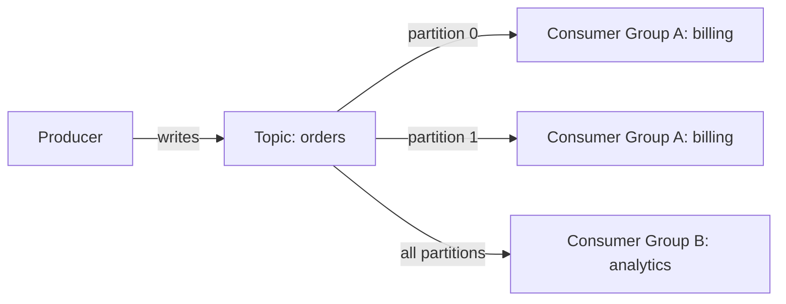

# Streaming — Kafka and RabbitMQ Event Streams

## Event Streaming vs Message Queuing

| Concept | Pattern | Analogy |
|---------|---------|---------|
| Message Queue | Point-to-point, consumed once | Task assignment |
| Event Stream | Append-only log, consumed by many | Newspaper subscription |

## Kafka Mental Model



- **Topic**: Named stream of events (like a table)
- **Partition**: Ordered, append-only segment of a topic (parallelism unit)
- **Consumer Group**: Set of consumers that share partitions (each partition read by one consumer in a group)
- **Offset**: Position in a partition (consumer tracks its own offset)

## Step 1: Spring Kafka Producer

```xml
<dependency>
    <groupId>org.springframework.kafka</groupId>
    <artifactId>spring-kafka</artifactId>
</dependency>
```

```java
@Service
@RequiredArgsConstructor
public class OrderEventProducer {
    private final KafkaTemplate<String, OrderEvent> kafkaTemplate;

    public void publishOrderCreated(Order order) {
        var event = new OrderEvent(
            "ORDER_CREATED", order.getId(),
            order.getCustomerId(), Instant.now());
        kafkaTemplate.send("orders",
            String.valueOf(order.getId()), event);
    }
}

public record OrderEvent(
    String type, Long orderId,
    Long customerId, Instant timestamp
) {}
```

The key (`order.getId()`) ensures all events for the same order go to the same partition — preserving order.

## Step 2: Spring Kafka Consumer

```java
@Component
@RequiredArgsConstructor
public class OrderEventConsumer {
    private final BillingService billingService;

    @KafkaListener(
        topics = "orders",
        groupId = "billing-service",
        containerFactory = "orderListenerFactory"
    )
    public void handleOrderEvent(
            ConsumerRecord<String, OrderEvent> record,
            Acknowledgment ack) {
        var event = record.value();
        billingService.processOrder(event);
        ack.acknowledge();
    }
}
```

```java
@Configuration
@RequiredArgsConstructor
public class KafkaConfig {
    @Bean
    public ConcurrentKafkaListenerContainerFactory<String, OrderEvent>
            orderListenerFactory(
                ConsumerFactory<String, OrderEvent> consumerFactory) {
        var factory = new ConcurrentKafkaListenerContainerFactory
            <String, OrderEvent>();
        factory.setConsumerFactory(consumerFactory);
        factory.getContainerProperties()
            .setAckMode(ContainerProperties.AckMode.MANUAL);
        return factory;
    }
}
```

```yaml
spring:
  kafka:
    bootstrap-servers: localhost:9092
    consumer:
      auto-offset-reset: earliest
      key-deserializer: org.apache.kafka.common.serialization.StringDeserializer
      value-deserializer: org.springframework.kafka.support.serializer.JsonDeserializer
      properties:
        spring.json.trusted.packages: com.example
    producer:
      key-serializer: org.apache.kafka.common.serialization.StringSerializer
      value-serializer: org.springframework.kafka.support.serializer.JsonSerializer
```

## Step 3: RabbitMQ Streams

RabbitMQ is a message broker, not a log. But it supports stream queues for Kafka-like semantics:

```java
@Component
public class PaymentEventConsumer {
    @RabbitListener(queues = "payment-events")
    public void handlePayment(PaymentEvent event) {
        processPayment(event);
    }
}

@Service
@RequiredArgsConstructor
public class PaymentEventProducer {
    private final RabbitTemplate rabbitTemplate;

    public void publish(PaymentEvent event) {
        rabbitTemplate.convertAndSend(
            "payment-exchange", "payment.created", event);
    }
}
```

## When Kafka vs RabbitMQ

| Kafka | RabbitMQ |
|-------|----------|
| Event streaming (append-only log) | Task queuing (consume and delete) |
| Multiple consumers replay events | Single consumer per message |
| High throughput, ordered partitions | Flexible routing (exchanges, bindings) |
| Long-term event storage | Transient message delivery |
| Event sourcing, analytics | Email sending, job queues |

## Key Points

- Kafka: events are persisted and replayable — multiple consumer groups read independently
- RabbitMQ: messages are consumed and acknowledged — good for task distribution
- Use partition keys to guarantee ordering for related events
- Set `auto-offset-reset: earliest` in dev so you don't miss events during development
- Manual acknowledgment (`AckMode.MANUAL`) gives you at-least-once processing
