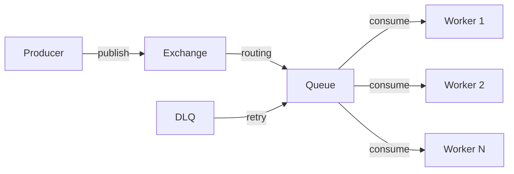

# Message Queue — Point-to-Point with RabbitMQ

## The Model

A message queue delivers each message to exactly one consumer. The producer sends to a queue, one worker picks it up, processes it, and acknowledges.



## Core Concepts

- **Exchange**: Receives messages from producers and routes them to queues
- **Queue**: Stores messages until consumed
- **Binding**: Rule connecting an exchange to a queue
- **Dead Letter Queue (DLQ)**: Where failed messages go after max retries

## Step 1: Setup RabbitMQ

```xml
<dependency>
    <groupId>org.springframework.boot</groupId>
    <artifactId>spring-boot-starter-amqp</artifactId>
</dependency>
```

```yaml
spring:
  rabbitmq:
    host: localhost
    port: 5672
    listener:
      simple:
        acknowledge-mode: manual
        prefetch: 10
        retry:
          enabled: true
          max-attempts: 3
          initial-interval: 1000
          multiplier: 2
```

## Step 2: Queue Configuration

```java
@Configuration
public class RabbitMQConfig {
    static final String EMAIL_QUEUE = "email-sending";
    static final String EMAIL_DLQ = "email-sending.dlq";
    static final String EMAIL_EXCHANGE = "email-exchange";

    @Bean
    public Queue emailQueue() {
        return QueueBuilder.durable(EMAIL_QUEUE)
            .withArgument("x-dead-letter-exchange", "")
            .withArgument("x-dead-letter-routing-key", EMAIL_DLQ)
            .withArgument("x-message-ttl", 300000)
            .build();
    }

    @Bean
    public Queue emailDeadLetterQueue() {
        return QueueBuilder.durable(EMAIL_DLQ).build();
    }

    @Bean
    public DirectExchange emailExchange() {
        return new DirectExchange(EMAIL_EXCHANGE);
    }

    @Bean
    public Binding emailBinding(Queue emailQueue,
            DirectExchange emailExchange) {
        return BindingBuilder.bind(emailQueue)
            .to(emailExchange).with("email.send");
    }

    @Bean
    public MessageConverter jsonMessageConverter() {
        return new Jackson2JsonMessageConverter();
    }

    @Bean
    public RabbitTemplate rabbitTemplate(
            ConnectionFactory factory,
            MessageConverter converter) {
        var template = new RabbitTemplate(factory);
        template.setMessageConverter(converter);
        return template;
    }
}
```

## Step 3: Producer

```java
@Service
@RequiredArgsConstructor
public class EmailQueueProducer {
    private final RabbitTemplate rabbitTemplate;

    public void sendEmail(EmailTask task) {
        rabbitTemplate.convertAndSend(
            RabbitMQConfig.EMAIL_EXCHANGE,
            "email.send",
            task);
    }
}

public record EmailTask(
    String to, String subject,
    String template, Map<String, String> variables
) {}
```

## Step 4: Consumer with Manual Ack

```java
@Component
@RequiredArgsConstructor
@Slf4j
public class EmailQueueConsumer {
    private final EmailService emailService;

    @RabbitListener(queues = RabbitMQConfig.EMAIL_QUEUE)
    public void handleEmail(EmailTask task, Channel channel,
            @Header(AmqpHeaders.DELIVERY_TAG) long tag) throws IOException {
        try {
            emailService.send(task);
            channel.basicAck(tag, false);
            log.info("Email sent to {}", task.to());
        } catch (TemporaryException e) {
            channel.basicNack(tag, false, true);
            log.warn("Retrying email to {}", task.to());
        } catch (PermanentException e) {
            channel.basicNack(tag, false, false);
            log.error("Email permanently failed for {}: {}",
                task.to(), e.getMessage());
        }
    }
}
```

- `basicAck`: Message processed successfully, remove from queue
- `basicNack(requeue=true)`: Temporary failure, put back in queue for retry
- `basicNack(requeue=false)`: Permanent failure, send to DLQ

## At-Least-Once vs Exactly-Once

| Guarantee | Meaning | How |
|-----------|---------|-----|
| At-most-once | Message might be lost | Auto-ack before processing |
| At-least-once | Message delivered at least once (may duplicate) | Manual ack after processing |
| Exactly-once | Delivered exactly once | Idempotent consumers + dedup |

RabbitMQ provides at-least-once with manual acknowledgment. Make your consumers idempotent to handle duplicates:

```java
@Service
@RequiredArgsConstructor
public class EmailService {
    private final SentEmailRepository sentRepo;

    public void send(EmailTask task) {
        var dedupKey = task.to() + ":" + task.subject() + ":" + task.template();
        if (sentRepo.existsByDedupKey(dedupKey)) {
            return;
        }
        // actually send email
        sendViaSmtp(task);
        sentRepo.save(new SentEmail(dedupKey));
    }
}
```

## Key Points

- Use RabbitMQ for task queues — each message processed by exactly one worker
- Always use manual acknowledgment — auto-ack loses messages on failure
- Configure a DLQ — inspect failed messages instead of losing them
- Make consumers idempotent — at-least-once means possible duplicates
- Set `prefetch` to limit unacked messages per consumer (prevents overload)
