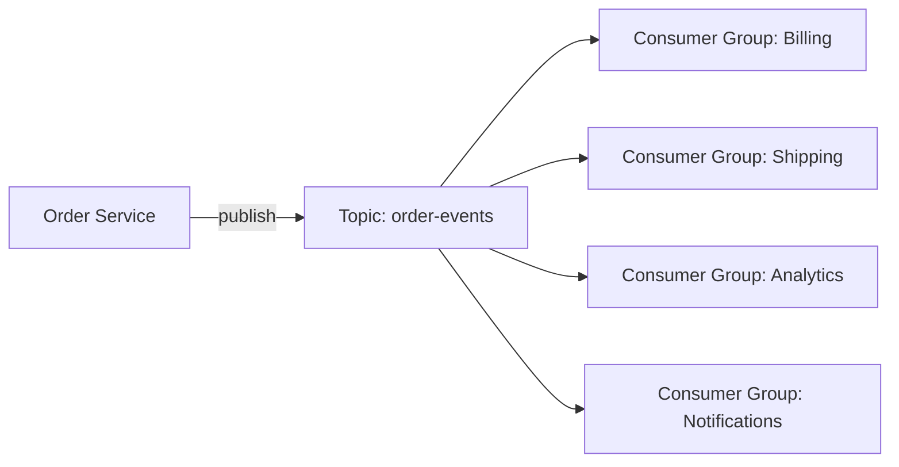

# Pub/Sub — Topic-Based Fan-Out with Kafka

## The Model

In pub/sub, a producer publishes events to a topic. Multiple consumer groups each receive a copy of every event. Each group processes independently at its own pace.

> **Diagram:** Order Service publishes to a Kafka topic, which fans out to four independent consumer groups: Billing, Shipping, Analytics, and Notifications.



## Pub/Sub vs Point-to-Point

| Pub/Sub (Kafka) | Point-to-Point (RabbitMQ) |
|-----------------|--------------------------|
| All groups get every event | One consumer gets the message |
| Consumer manages offset | Broker removes after ack |
| Replay from any point | No replay |
| Fan-out for free | Requires multiple queues |

## Step 1: Producer — Publish Order Events

```java
@Service
@RequiredArgsConstructor
public class OrderEventPublisher {
    private final KafkaTemplate<String, OrderEvent> kafkaTemplate;

    public void publishCreated(Order order) {
        publish("ORDER_CREATED", order);
    }

    public void publishCancelled(Order order) {
        publish("ORDER_CANCELLED", order);
    }

    private void publish(String type, Order order) {
        var event = new OrderEvent(type, order.getId(),
            order.getCustomerId(), order.getTotal(), Instant.now());
        kafkaTemplate.send("order-events",
            String.valueOf(order.getId()), event)
            .whenComplete((result, ex) -> {
                if (ex != null) {
                    log.error("Failed to publish {} for order {}",
                        type, order.getId(), ex);
                }
            });
    }
}

public record OrderEvent(
    String type, Long orderId,
    Long customerId, BigDecimal total,
    Instant timestamp
) {}
```

The key is `order.getId()` — all events for the same order land in the same partition, guaranteeing order per entity.

## Step 2: Multiple Consumer Groups

```java
@Component
@RequiredArgsConstructor
@Slf4j
public class BillingConsumer {
    private final BillingService billingService;

    @KafkaListener(
        topics = "order-events",
        groupId = "billing-service"
    )
    public void handle(OrderEvent event) {
        switch (event.type()) {
            case "ORDER_CREATED" ->
                billingService.createInvoice(event);
            case "ORDER_CANCELLED" ->
                billingService.refund(event);
        }
        log.info("Billing processed event {} for order {}",
            event.type(), event.orderId());
    }
}
```

```java
@Component
@RequiredArgsConstructor
public class ShippingConsumer {
    private final ShippingService shippingService;

    @KafkaListener(
        topics = "order-events",
        groupId = "shipping-service"
    )
    public void handle(OrderEvent event) {
        if ("ORDER_CREATED".equals(event.type())) {
            shippingService.scheduleDelivery(event);
        }
    }
}
```

```java
@Component
@RequiredArgsConstructor
public class AnalyticsConsumer {
    private final AnalyticsService analyticsService;

    @KafkaListener(
        topics = "order-events",
        groupId = "analytics-service"
    )
    public void handle(OrderEvent event) {
        analyticsService.trackOrderEvent(event);
    }
}
```

Each `groupId` is a separate consumer group. All groups receive every event. Adding a new consumer (e.g., a notification service) is just adding another `@KafkaListener` with a unique group ID.

## Step 3: Partition Key and Ordering

```yaml
spring:
  kafka:
    producer:
      properties:
        partitioner.class: org.apache.kafka.clients.producer.RoundRobinPartitioner
```

By default, Kafka hashes the key to pick a partition. Events with the same key always go to the same partition. Within a partition, events are ordered. Across partitions, no ordering guarantee.

## Step 4: Offset Management

```yaml
spring:
  kafka:
    consumer:
      auto-offset-reset: earliest  # read from beginning on first start
      enable-auto-commit: false    # commit manually for control
```

```java
@KafkaListener(topics = "order-events", groupId = "billing-service")
public void handle(OrderEvent event, Acknowledgment ack) {
    billingService.createInvoice(event);
    ack.acknowledge();
}
```

Manual offset commit means: only advance the offset after successful processing. If the consumer crashes, it restarts from the last committed offset.

## Key Points

- Kafka topics enable fan-out: one event, N independent consumers
- Each consumer group tracks its own offset — they don't interfere
- Use the entity ID as the key for partition-level ordering
- New consumers start from `earliest` or `latest` — configure based on use case
- Pub/sub for event-driven architecture; point-to-point for task distribution
