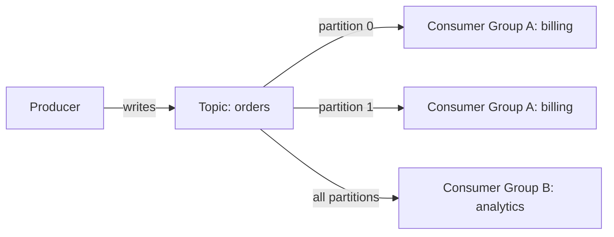

# Streaming — Real-Time ETL with Kafka Streams

## Event Streaming vs Message Queuing

| Concept | Pattern | Analogy |
|---------|---------|---------|
| Message Queue | Point-to-point, consumed once | Task assignment |
| Event Stream | Append-only log, consumed by many | Newspaper subscription |
| Kafka Streams | Real-time processing on streams | Assembly line — transform as data flows |

Kafka Streams is a library for building real-time stream processing applications. Not a separate server — it's embedded in your Java app. Think of it as real-time ETL: data flows in, you transform/aggregate/filter, results flow out.

## Kafka Mental Model

> **Diagram:** Kafka topic with partitions distributed across Consumer Group A (billing) workers and fully consumed by Consumer Group B (analytics).



- **Topic**: Named stream of events (like a table)
- **Partition**: Ordered, append-only segment of a topic (parallelism unit)
- **Consumer Group**: Set of consumers that share partitions
- **Offset**: Position in a partition (consumer tracks its own offset)

## When Kafka Streams vs Plain Consumer

| Plain Kafka Consumer | Kafka Streams |
|---------------------|---------------|
| Read message, process, done | Continuous flow processing |
| Manual offset management | Automatic offset management |
| No state management | Local state stores (RocksDB) |
| No windowing | Time-based windowing and aggregation |
| Simple transformations | Joins, aggregates, branch, merge |

Use plain consumers for simple ingestion. Use Kafka Streams for real-time analytics, joins, and windowed aggregations.

## Step 1: Dependencies

```xml
<dependency>
    <groupId>org.springframework.kafka</groupId>
    <artifactId>spring-kafka</artifactId>
</dependency>
<dependency>
    <groupId>org.apache.kafka</groupId>
    <artifactId>kafka-streams</artifactId>
</dependency>
```

```yaml
spring:
  kafka:
    bootstrap-servers: localhost:9092
  kafka-streams:
    application-id: order-stream-processor
    properties:
      default.key.serde: org.apache.kafka.common.serialization.Serdes$StringSerde
      default.value.serde: org.apache.kafka.common.serialization.Serdes$StringSerde
      processing.guarantee: exactly_once_v2
      state.dir: /tmp/kafka-streams/state
```

`processing.guarantee: exactly_once_v2` enables exactly-once semantics — no duplicates, no data loss.

## Step 2: Message Models

```java
public record OrderEvent(
    String type,
    Long orderId,
    Long customerId,
    BigDecimal total,
    Instant timestamp
) {}

public record PaymentEvent(
    String type,
    Long orderId,
    String method,
    BigDecimal amount,
    Instant timestamp
) {}

public record EnrichedOrder(
    Long orderId,
    Long customerId,
    BigDecimal orderTotal,
    String paymentMethod,
    BigDecimal paymentAmount,
    Instant orderTime,
    Instant paymentTime
) {}
```

## Step 3: Stream Topology — Filter and Route

```java
@Configuration
@Slf4j
public class OrderStreamProcessor {

    @Bean
    public KStream<String, String> orderStream(
            StreamsBuilder builder) {

        KStream<String, String> stream =
            builder.stream("orders");

        stream
            .mapValues(this::parseOrder)
            .filter((key, order) -> order != null)
            .filter((key, order) -> order.total().compareTo(
                BigDecimal.valueOf(1000)) >= 0)
            .mapValues(this::toJson)
            .to("orders.high-value");

        stream
            .mapValues(this::parseOrder)
            .filter((key, order) -> order != null)
            .filter((key, order) -> "ORDER_CANCELLED"
                .equals(order.type()))
            .mapValues(this::toJson)
            .to("orders.cancelled");

        log.info("Stream topology: orders -> [high-value, cancelled]");
        return stream;
    }

    private OrderEvent parseOrder(String value) {
        try {
            return new ObjectMapper()
                .readValue(value, OrderEvent.class);
        } catch (Exception e) {
            return null;
        }
    }

    private String toJson(Object obj) {
        try {
            return new ObjectMapper().writeValueAsString(obj);
        } catch (Exception e) {
            throw new RuntimeException(e);
        }
    }
}
```

Input: all orders → Output: two derived topics. High-value orders go to `orders.high-value`, cancelled orders go to `orders.cancelled`. This is real-time filtering — no batch job, no cron.

## Step 4: Join Two Streams (Order + Payment)

Join order events with payment events to create enriched records. Real-time data enrichment — like a SQL JOIN but continuous.

```java
@Bean
public KStream<String, String> enrichedOrderStream(
        StreamsBuilder builder) {

    var orders = builder.stream("orders")
        .mapValues(this::parseOrder)
        .filter((k, v) -> v != null)
        .selectKey((k, v) -> String.valueOf(v.orderId()));

    var payments = builder.stream("payments")
        .mapValues(this::parsePayment)
        .filter((k, v) -> v != null)
        .selectKey((k, v) -> String.valueOf(v.orderId()));

    var joined = orders.join(
        payments,
        (order, payment) -> new EnrichedOrder(
            order.orderId(),
            order.customerId(),
            order.total(),
            payment.method(),
            payment.amount(),
            order.timestamp(),
            payment.timestamp()
        ),
        JoinWindows.ofTimeDifferenceWithNoGrace(
            Duration.ofMinutes(5))
    );

    joined.mapValues(this::toJson)
        .to("orders.enriched");

    return joined.mapValues(this::toJson);
}
```

The join window is 5 minutes — if a payment doesn't arrive within 5 minutes of the order, the join drops it. This handles out-of-order events.

## Step 5: Windowed Aggregation — Revenue per Hour

```java
@Bean
public KTable<Windowed<String>, String> hourlyRevenue(
        StreamsBuilder builder) {

    return builder
        .stream("orders")
        .mapValues(this::parseOrder)
        .filter((k, v) -> v != null)
        .filter((k, v) -> "ORDER_CREATED".equals(v.type()))
        .groupBy((k, v) -> "total",
            Serialized.with(Serdes.String(), Serdes.String()))
        .windowedBy(TimeWindows.ofSizeWithNoGrace(
            Duration.ofHours(1)))
        .aggregate(
            () -> BigDecimal.ZERO,
            (key, orderValue, total) -> {
                var order = parseOrder(orderValue);
                return total.add(order.total());
            },
            Materialized.with(
                Serdes.String(),
                Serdes.serdeFrom(
                    (topic, data) -> data.toString().getBytes(),
                    (topic, data) -> BigDecimal.ZERO))
        );
}
```

This continuously computes revenue per hour. Every new order updates the running total. Query it from the state store in real-time:

```java
@RestController
@RequiredArgsConstructor
public class RevenueController {
    private final KafkaStreams kafkaStreams;

    @GetMapping("/api/revenue/current")
    public Map<String, String> currentRevenue() {
        var store = kafkaStreams.store(
            StoreQueryParameters.fromNameAndType(
                "KTABLE-TOTAL",
                QueryableStoreTypes.keyValueStore())
        );
        return Map.of("totalRevenue", store.get("total").toString());
    }
}
```

## Step 6: Branch — Route to Multiple Topics by Condition

```java
@Bean
public void branchOrders(StreamsBuilder builder) {
    var stream = builder.stream("orders")
        .mapValues(this::parseOrder)
        .filter((k, v) -> v != null);

    KStream<String, OrderEvent>[] branches = stream.branch(
        (k, v) -> v.total().compareTo(BigDecimal.valueOf(500)) >= 0,
        (k, v) -> v.total().compareTo(BigDecimal.valueOf(100)) >= 0,
        (k, v) -> true
    );

    branches[0].mapValues(this::toJson).to("orders.premium");
    branches[1].mapValues(this::toJson).to("orders.standard");
    branches[2].mapValues(this::toJson).to("orders.budget");
}
```

One stream, three outputs based on order value. Premium (500+), Standard (100-499), Budget (< 100).

## When Kafka vs RabbitMQ

| Kafka | RabbitMQ |
|-------|----------|
| Event streaming (append-only log) | Task queuing (consume and delete) |
| Multiple consumers replay events | Single consumer per message |
| High throughput, ordered partitions | Flexible routing (exchanges, bindings) |
| Long-term event storage | Transient message delivery |
| Event sourcing, analytics, stream processing | Email sending, job queues |

## Key Points

- Kafka Streams is a library, not a server — no separate cluster to manage
- Use it for real-time ETL: filter, join, aggregate, route events as they arrive
- Local state stores (RocksDB) enable stateful operations with interactive queries
- `exactly_once_v2` processing guarantee prevents duplicates in stream processing
- Joins have time windows — handle late-arriving events with grace periods
- Start with plain `@KafkaListener` for simple consumption, upgrade to Streams for complex processing
