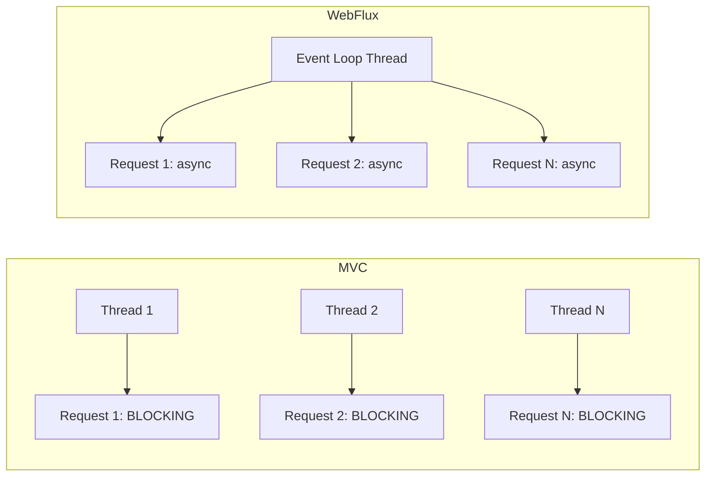

# Reactive Workload — Spring WebFlux

## The Reactive Model

Traditional Spring MVC uses one thread per request. 200 concurrent requests = 200 threads. Spring WebFlux uses an event loop: a small number of threads handle thousands of concurrent connections via non-blocking I/O.



## When Reactive vs Imperative

| Reactive (WebFlux) | Imperative (MVC) |
|--------------------|--------------------|
| High I/O concurrency (thousands of connections) | Simple CRUD APIs |
| Streaming responses | Blocking database (JPA) |
| Gateway, proxy services | Team unfamiliar with reactive |
| Microservice calling many downstream services | Standard web application |

Do NOT use reactive if your database driver is blocking (JPA, JDBC). You lose the benefit.

## Step 1: Setup WebFlux

```xml
<dependency>
    <groupId>org.springframework.boot</groupId>
    <artifactId>spring-boot-starter-webflux</artifactId>
</dependency>
```

## Step 2: Reactive Controller

```java
@RestController
@RequestMapping("/api/products")
@RequiredArgsConstructor
public class ProductController {
    private final ProductService service;

    @GetMapping
    public Flux<ProductResponse> list() {
        return service.findAll();
    }

    @GetMapping("/{id}")
    public Mono<ResponseEntity<ProductResponse>> get(@PathVariable Long id) {
        return service.findById(id)
            .map(ResponseEntity::ok)
            .defaultIfEmpty(ResponseEntity.notFound().build());
    }

    @PostMapping
    public Mono<ResponseEntity<ProductResponse>> create(
            @Valid @RequestBody Mono<ProductRequest> request) {
        return request.flatMap(service::create)
            .map(saved -> ResponseEntity.status(HttpStatus.CREATED).body(saved));
    }

    @DeleteMapping("/{id}")
    public Mono<ResponseEntity<Void>> delete(@PathVariable Long id) {
        return service.delete(id)
            .then(Mono.just(ResponseEntity.noContent().<Void>build()));
    }
}
```

- `Mono<T>`: 0 or 1 element (like `Optional` but async)
- `Flux<T>`: 0 to N elements (like a `Stream` but async)

## Step 3: Reactive Service with WebClient

```java
@Service
@RequiredArgsConstructor
public class ProductService {
    private final ProductRepository repository;
    private final WebClient webClient;

    public Flux<ProductResponse> findAll() {
        return repository.findAll()
            .map(this::toResponse);
    }

    public Mono<ProductResponse> findById(Long id) {
        return repository.findById(id)
            .map(this::toResponse);
    }

    public Mono<ProductResponse> create(ProductRequest request) {
        return validateCategory(request.categoryId())
            .then(repository.save(toEntity(request)))
            .map(this::toResponse);
    }

    public Mono<Void> delete(Long id) {
        return repository.deleteById(id);
    }

    private Mono<Category> validateCategory(String categoryId) {
        return webClient.get()
            .uri("/api/categories/{id}", categoryId)
            .retrieve()
            .bodyToMono(Category.class)
            .switchIfEmpty(Mono.error(
                new ResourceNotFoundException("Category not found")));
    }
}
```

## Step 4: Reactive Repository (R2DBC)

```xml
<dependency>
    <groupId>org.springframework.boot</groupId>
    <artifactId>spring-boot-starter-data-r2dbc</artifactId>
</dependency>
```

```java
public interface ProductRepository
        extends ReactiveCrudRepository<Product, Long> {
    Flux<Product> findByCategory(String category);
    Mono<Product> findByName(String name);
}
```

```yaml
spring:
  r2dbc:
    url: r2dbc:postgresql://localhost:5432/products
    username: admin
    password: secret
```

## Step 5: Error Handling

```java
@GetMapping("/{id}")
public Mono<ResponseEntity<ProductResponse>> get(@PathVariable Long id) {
    return service.findById(id)
        .map(ResponseEntity::ok)
        .onErrorResume(ResourceNotFoundException.class, e ->
            Mono.just(ResponseEntity.notFound().build()))
        .onErrorResume(Exception.class, e ->
            Mono.just(ResponseEntity.status(HttpStatus.INTERNAL_SERVER_ERROR)
                .build()));
}
```

## Key Points

- WebFlux shines with non-blocking I/O: WebClient calls, R2DBC, reactive streams
- Using WebFlux with JPA/JDBC defeats the purpose — the threads block on DB calls
- `Mono` for single results, `Flux` for collections — think in streams, not objects
- The event loop must never block — avoid `Thread.sleep`, blocking I/O, or `block()` calls
- Start with MVC. Switch to WebFlux only when you hit thread scalability limits
