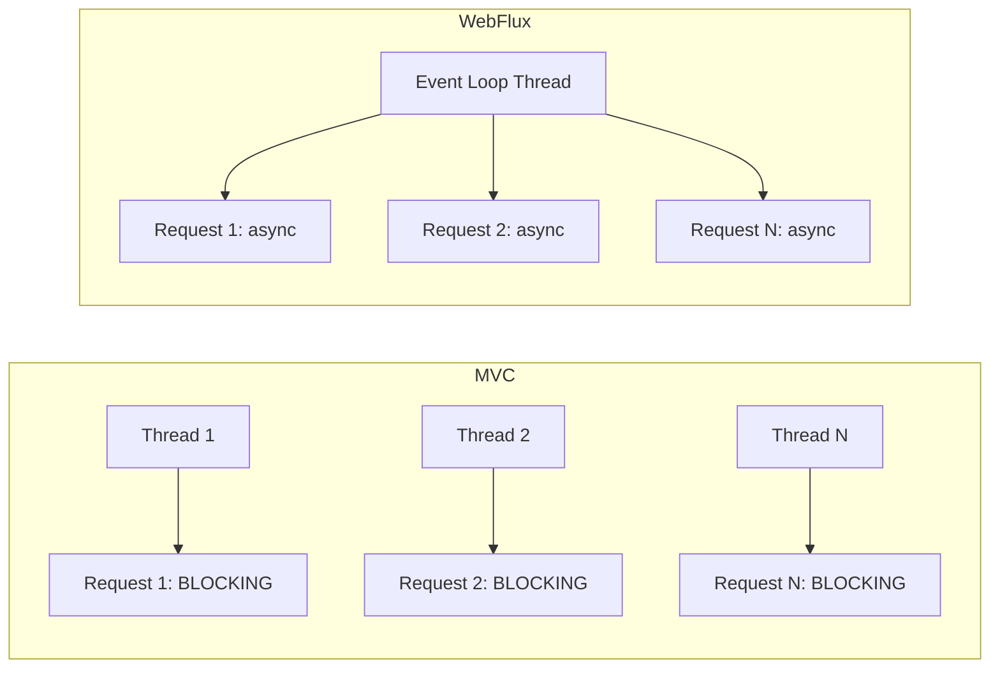

# Reactive Workload — Kotlin Coroutines + Spring WebFlux (Java)

## The Reactive Model

Traditional Spring MVC uses one thread per request. 200 concurrent requests = 200 threads. Reactive uses an event loop: a small number of threads handle thousands of concurrent connections via non-blocking I/O.

> **Diagram:** Comparison of MVC (one blocking thread per request) versus WebFlux (single event loop thread handling multiple async requests concurrently).



## When Reactive vs Imperative

| Reactive (WebFlux) | Imperative (MVC) |
|---------------------|-------------------|
| High I/O concurrency (thousands of connections) | Simple CRUD APIs |
| Streaming responses | Blocking database (JPA) |
| Gateway, proxy services | Team unfamiliar with reactive |
| Microservice calling many downstream services | Standard web application |

Do NOT use reactive if your database driver is blocking (JPA, JDBC). You lose the benefit.

## Why Kotlin Coroutines

Java WebFlux uses `Mono`/`Flux` — a chain of operators that's hard to read and debug. Kotlin coroutines let you write reactive code that **looks like normal sequential code**. Same non-blocking performance, dramatically simpler.

```java
// Java WebFlux — nested operator chains
return repository.findById(id)
    .flatMap(product -> validateCategory(product.getCategoryId())
        .map(valid -> product))
    .switchIfEmpty(Mono.error(new NotFoundException()));
```

```kotlin
// Kotlin coroutines — reads like normal code
val product = repository.findById(id) ?: throw NotFoundException()
validateCategory(product.categoryId)
return product
```

Both are non-blocking. The coroutine version is just easier to understand.

## Part 1: Kotlin Coroutines (Modern Approach)

### Step 1: Dependencies

```xml
<dependency>
    <groupId>org.springframework.boot</groupId>
    <artifactId>spring-boot-starter-webflux</artifactId>
</dependency>
<dependency>
    <groupId>org.jetbrains.kotlinx</groupId>
    <artifactId>kotlinx-coroutines-reactor</artifactId>
</dependency>
<dependency>
    <groupId>org.springframework.boot</groupId>
    <artifactId>spring-boot-starter-data-r2dbc</artifactId>
</dependency>
```

### Step 2: Coroutine Controller

```kotlin
// ProductController.kt
@RestController
@RequestMapping("/api/products")
class ProductController(private val service: ProductService) {

    @GetMapping
    suspend fun list(): List<ProductResponse> = service.findAll()

    @GetMapping("/{id}")
    suspend fun get(@PathVariable id: Long): ResponseEntity<ProductResponse> {
        val product = service.findById(id)
            ?: return ResponseEntity.notFound().build()
        return ResponseEntity.ok(product)
    }

    @PostMapping
    suspend fun create(@RequestBody @Valid request: ProductRequest):
            ResponseEntity<ProductResponse> {
        val saved = service.create(request)
        return ResponseEntity.status(HttpStatus.CREATED).body(saved)
    }

    @DeleteMapping("/{id}")
    suspend fun delete(@PathVariable id: Long): ResponseEntity<Void> {
        service.delete(id)
        return ResponseEntity.noContent().build()
    }
}
```

`suspend` functions are non-blocking. The thread is released while waiting for I/O. No `Mono`, no `Flux`, no operator chains.

### Step 3: Coroutine Service

```kotlin
// ProductService.kt
@Service
class ProductService(
    private val repository: ProductRepository,
    private val categoryClient: CategoryWebClient
) {

    suspend fun findAll(): List<ProductResponse> =
        repository.findAll().map { it.toResponse() }

    suspend fun findById(id: Long): ProductResponse? =
        repository.findById(id)?.toResponse()

    suspend fun create(request: ProductRequest): ProductResponse {
        categoryClient.validate(request.categoryId)
        val entity = request.toEntity()
        val saved = repository.save(entity)
        return saved.toResponse()
    }

    suspend fun delete(id: Long) {
        repository.deleteById(id)
    }
}
```

### Step 4: WebClient as Coroutine

```kotlin
// CategoryWebClient.kt
@Component
class CategoryWebClient(
    private val webClient: WebClient
) {
    suspend fun validate(categoryId: String): Category {
        return webClient.get()
            .uri("/api/categories/{id}", categoryId)
            .retrieve()
            .awaitBody<Category>()
    }

    suspend fun exists(categoryId: String): Boolean {
        return try {
            validate(categoryId)
            true
        } catch (e: WebClientResponseException.NotFound) {
            false
        }
    }
}
```

`awaitBody<T>()` is the coroutine bridge for WebClient. No `.block()`, no `Mono`.

### Step 5: Reactive Repository (R2DBC)

```kotlin
// ProductRepository.kt
interface ProductRepository : ReactiveCrudRepository<Product, Long> {
    fun findByCategory(category: String): Flux<Product>
    suspend fun findByName(name: String): Product?
}
```

Spring Data R2DBC supports Kotlin coroutines directly. `suspend fun` returns a single entity, `Flow<T>` for streams.

```yaml
spring:
  r2dbc:
    url: r2dbc:postgresql://localhost:5432/products
    username: admin
    password: secret
```

### Step 6: Error Handling

```kotlin
// GlobalErrorHandler.kt
@ControllerAdvice
class GlobalErrorHandler {

    @ExceptionHandler(NotFoundException::class)
    suspend fun handleNotFound(e: NotFoundException): ResponseEntity<ErrorResponse> {
        return ResponseEntity.status(HttpStatus.NOT_FOUND)
            .body(ErrorResponse(e.message ?: "Not found"))
    }

    @ExceptionHandler(WebClientResponseException::class)
    suspend fun handleUpstream(e: WebClientResponseException): ResponseEntity<ErrorResponse> {
        return ResponseEntity.status(e.statusCode)
            .body(ErrorResponse("Upstream error: ${e.message}"))
    }
}
```

## Part 2: Java WebFlux (Classic Approach)

Same service, Java WebFlux style for comparison.

### Step 1: WebFlux Controller

```java
// ProductController.java
@RestController
@RequestMapping("/api/products")
@RequiredArgsConstructor
public class ProductController {
    private final ProductService service;

    @GetMapping
    public Flux<ProductResponse> list() {
        return service.findAll();
    }

    @GetMapping("/{id}")
    public Mono<ResponseEntity<ProductResponse>> get(@PathVariable Long id) {
        return service.findById(id)
            .map(ResponseEntity::ok)
            .defaultIfEmpty(ResponseEntity.notFound().build());
    }

    @PostMapping
    public Mono<ResponseEntity<ProductResponse>> create(
            @Valid @RequestBody Mono<ProductRequest> request) {
        return request.flatMap(service::create)
            .map(saved -> ResponseEntity.status(HttpStatus.CREATED).body(saved));
    }

    @DeleteMapping("/{id}")
    public Mono<ResponseEntity<Void>> delete(@PathVariable Long id) {
        return service.delete(id)
            .then(Mono.just(ResponseEntity.noContent().<Void>build()));
    }
}
```

- `Mono<T>`: 0 or 1 element (like `Optional` but async)
- `Flux<T>`: 0 to N elements (like a `Stream` but async)

### Step 2: WebFlux Service with WebClient

```java
// ProductService.java
@Service
@RequiredArgsConstructor
public class ProductService {
    private final ProductRepository repository;
    private final WebClient webClient;

    public Flux<ProductResponse> findAll() {
        return repository.findAll().map(this::toResponse);
    }

    public Mono<ProductResponse> findById(Long id) {
        return repository.findById(id).map(this::toResponse);
    }

    public Mono<ProductResponse> create(ProductRequest request) {
        return validateCategory(request.categoryId())
            .then(repository.save(toEntity(request)))
            .map(this::toResponse);
    }

    public Mono<Void> delete(Long id) {
        return repository.deleteById(id);
    }

    private Mono<Category> validateCategory(String categoryId) {
        return webClient.get()
            .uri("/api/categories/{id}", categoryId)
            .retrieve()
            .bodyToMono(Category.class)
            .switchIfEmpty(Mono.error(
                new ResourceNotFoundException("Category not found")));
    }
}
```

### Side-by-Side Comparison

```kotlin
// Kotlin coroutine — create a product
suspend fun create(request: ProductRequest): ProductResponse {
    categoryClient.validate(request.categoryId)  // non-blocking call
    val saved = repository.save(request.toEntity()) // non-blocking DB
    return saved.toResponse()
}
```

```java
// Java WebFlux — create a product
public Mono<ProductResponse> create(ProductRequest request) {
    return validateCategory(request.categoryId())  // returns Mono
        .then(repository.save(toEntity(request)))   // chain Mono
        .map(this::toResponse);                     // transform
}
```

Same outcome. Kotlin reads top-to-bottom. Java reads as a pipeline chain.

## Key Points

- Kotlin coroutines give you reactive performance with imperative readability
- `suspend` functions are non-blocking — the compiler handles the event loop interaction
- Use `awaitBody<T>()` for WebClient, suspend-compatible Spring Data for repositories
- Java WebFlux (`Mono`/`Flux`) still works — use it when your team is Java-only
- Both approaches require non-blocking drivers: R2DBC, WebClient, reactive Redis
- Do NOT use reactive with JPA/JDBC — the blocking calls defeat the entire purpose
- Start with MVC. Switch to reactive only when you hit thread scalability limits
