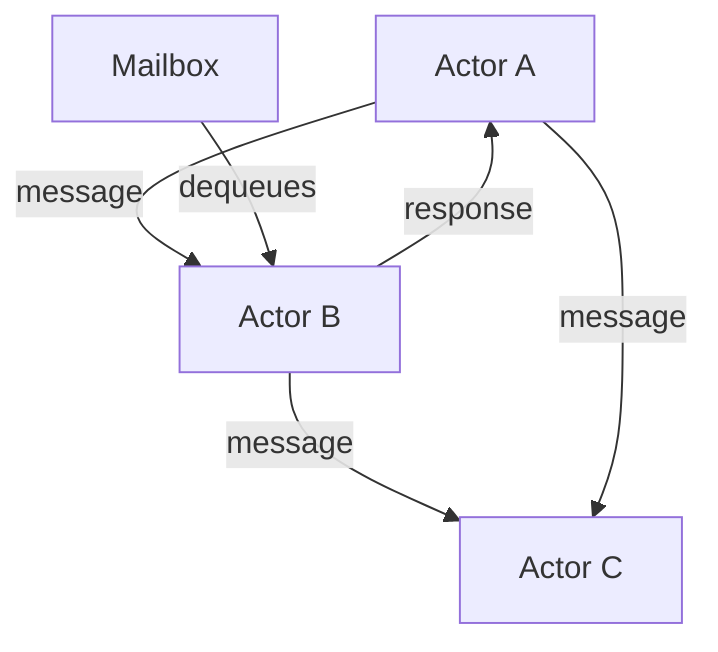

# Actor Workload — Actor Model on the JVM

## The Actor Model

An actor is a unit of computation with its own state, behavior, and mailbox. Actors communicate exclusively through messages. No shared state. No locks.



## Actor = State + Behavior + Mailbox

- **State**: Private, mutable data that only the actor itself can access
- **Behavior**: How the actor responds to each message
- **Mailbox**: Queue of incoming messages, processed one at a time

## When Actors vs Threads vs Reactive

| Model | Best For |
|-------|----------|
| Threads + Locks | Simple parallelism, shared state |
| Reactive (Mono/Flux) | I/O-bound streaming pipelines |
| Actors | Complex state machines, distributed systems, event-driven logic |

## Step 1: Akka Typed Setup

```xml
<dependency>
    <groupId>com.typesafe.akka</groupId>
    <artifactId>akka-actor-typed_2.13</artifactId>
    <version>2.8.5</version>
</dependency>
```

## Step 2: Define Messages

```java
sealed interface OrderCommand {}
record CreateOrder(Long orderId, String customer, BigDecimal amount)
    implements OrderCommand {}
record CancelOrder(Long orderId, String reason)
    implements OrderCommand {}
record GetOrderState(Long orderId, ActorRef<OrderResponse> replyTo)
    implements OrderCommand {}

sealed interface OrderResponse {}
record OrderStatus(Long orderId, String status, BigDecimal amount)
    implements OrderResponse {}
record OrderNotFound(Long orderId) implements OrderResponse {}
```

Sealed interfaces ensure the compiler checks that you handle all message types.

## Step 3: Define the Actor

```java
public class OrderActor extends AbstractBehavior<OrderCommand> {
    private final Map<Long, OrderState> orders = new HashMap<>();

    public static Behavior<OrderCommand> create() {
        return Behaviors.setup(OrderActor::new);
    }

    private OrderActor(ActorContext<OrderCommand> context) {
        super(context);
    }

    @Override
    public Receive<OrderCommand> createReceive() {
        return newReceiveBuilder()
            .onMessage(CreateOrder.class, this::onCreate)
            .onMessage(CancelOrder.class, this::onCancel)
            .onMessage(GetOrderState.class, this::onGetState)
            .onSignal(PostStop.class, signal -> {
                getContext().getLog().info("Order actor stopped");
                return this;
            })
            .build();
    }

    private Behavior<OrderCommand> onCreate(CreateOrder cmd) {
        var state = new OrderState(
            cmd.orderId(), cmd.customer(),
            cmd.amount(), "CREATED", Instant.now());
        orders.put(cmd.orderId(), state);
        getContext().getLog().info("Order {} created for {}",
            cmd.orderId(), cmd.customer());
        return this;
    }

    private Behavior<OrderCommand> onCancel(CancelOrder cmd) {
        var state = orders.get(cmd.orderId());
        if (state != null && !"CANCELLED".equals(state.status())) {
            orders.put(cmd.orderId(), state.withStatus("CANCELLED"));
            getContext().getLog().info("Order {} cancelled: {}",
                cmd.orderId(), cmd.reason());
        }
        return this;
    }

    private Behavior<OrderCommand> onGetState(GetOrderState cmd) {
        var state = orders.get(cmd.orderId());
        if (state != null) {
            cmd.replyTo().tell(new OrderStatus(
                state.orderId(), state.status(), state.amount()));
        } else {
            cmd.replyTo().tell(new OrderNotFound(cmd.orderId()));
        }
        return this;
    }
}

record OrderState(
    Long orderId, String customer,
    BigDecimal amount, String status,
    Instant createdAt
) {
    OrderState withStatus(String newStatus) {
        return new OrderState(orderId, customer, amount, newStatus, createdAt);
    }
}
```

## Step 4: Supervision and Error Handling

```java
public static Behavior<OrderCommand> createWithSupervision() {
    return Behaviors.supervise(
        Behaviors.setup(OrderActor::new)
    ).onFailure(SnapshotFailedException.class,
        SupervisorStrategy.restart().withLimit(3, Duration.ofMinutes(1)));
}
```

Supervision defines what happens when an actor fails. The parent decides: restart, resume, stop, or escalate.

## Step 5: Spring Integration

```java
@Configuration
public class AkkaConfig {
    @Bean
    public ActorSystem<OrderCommand> orderSystem() {
        return ActorSystem.create(OrderActor.create(), "order-system");
    }

    @Bean
    public OrderActorGateway orderGateway(
            ActorSystem<OrderCommand> system) {
        return new OrderActorGateway(system);
    }
}

@Component
@RequiredArgsConstructor
public class OrderActorGateway {
    private final ActorSystem<OrderCommand> system;

    public CompletableFuture<OrderResponse> getOrderState(Long orderId) {
        var future = new CompletableFuture<OrderResponse>();
        var adapter = system.system().executionContext();
        AskPattern.<OrderCommand, OrderResponse>ask(
            system,
            replyTo -> new GetOrderState(orderId, replyTo),
            Duration.ofSeconds(5),
            system.scheduler()
        ).whenComplete((response, error) -> {
            if (error != null) future.completeExceptionally(error);
            else future.complete(response);
        });
        return future;
    }
}
```

## Key Points

- Actors own their state — no shared mutable state, no locks, no race conditions
- Messages are processed one at a time per actor — safe concurrent access
- Supervision hierarchies handle failures gracefully — parent restarts child
- Use actors for complex state machines, workflow engines, and distributed coordination
- Overkill for simple CRUD — use reactive or thread pools for straightforward concurrency
