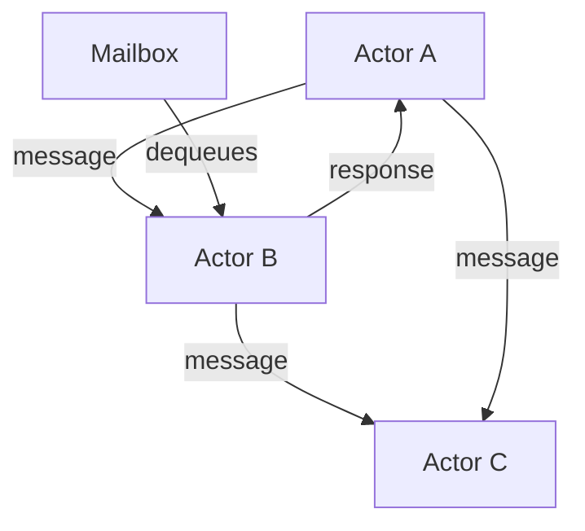

# Actor Workload — Actor Model with Scala + Akka Typed

> **Last verified:** June 2026 — Akka 2.8.5, Scala 2.13.12

## The Actor Model

An actor is a unit of computation with its own state, behavior, and mailbox. Actors communicate exclusively through messages. No shared state. No locks.



## Actor = State + Behavior + Mailbox

- **State**: Private, mutable data that only the actor itself can access
- **Behavior**: How the actor responds to each message (pattern matching)
- **Mailbox**: Queue of incoming messages, processed one at a time

## When Actors vs Threads vs Reactive

| Model | Best For |
|-------|----------|
| Threads + Locks | Simple parallelism, shared state |
| Reactive (Mono/Flux) | I/O-bound streaming pipelines |
| Actors | Complex state machines, distributed systems, event-driven logic |

## Why Scala

Akka is written in Scala. The typed API, pattern matching, and sealed traits make actor message handling idiomatic and compiler-safe. Scala's `sealed trait` ensures exhaustive matching — forget a message type and the compiler tells you.

## Step 1: Build Configuration

```scala
// build.sbt
name := "order-actor-system"
version := "0.1.0"
scalaVersion := "2.13.12"

libraryDependencies ++= Seq(
  "com.typesafe.akka" %% "akka-actor-typed" % "2.8.5",
  "com.typesafe.akka" %% "akka-actor-testkit-typed" % "2.8.5" % Test,
  "ch.qos.logback" % "logback-classic" % "1.4.11"
)
```

## Step 2: Define Messages with Sealed Traits

```scala
// OrderMessages.scala
object OrderMessages {

  sealed trait OrderCommand
  case class CreateOrder(
    orderId: Long,
    customer: String,
    amount: BigDecimal
  ) extends OrderCommand

  case class CancelOrder(
    orderId: Long,
    reason: String
  ) extends OrderCommand

  case class GetOrderStatus(
    orderId: Long,
    replyTo: ActorRef[OrderResponse]
  ) extends OrderCommand

  sealed trait OrderResponse
  case class OrderStatus(
    orderId: Long,
    status: String,
    amount: BigDecimal
  ) extends OrderResponse

  case class OrderNotFound(orderId: Long) extends OrderResponse
}
```

Sealed traits force exhaustive pattern matching. If you add a new command, the compiler errors on every `match` that doesn't handle it.

## Step 3: Define the Actor

```scala
// OrderActor.scala
import OrderMessages._
import akka.actor.typed.Behavior
import akka.actor.typed.scaladsl.Behaviors

object OrderActor {

  case class OrderState(
    orderId: Long,
    customer: String,
    amount: BigDecimal,
    status: String,
    createdAt: java.time.Instant
  ) {
    def withStatus(newStatus: String): OrderState =
      copy(status = newStatus)
  }

  def apply(): Behavior[OrderCommand] =
    Behaviors.setup { context =>
      var orders = Map.empty[Long, OrderState]

      Behaviors.receiveMessage {
        case CreateOrder(orderId, customer, amount) =>
          val state = OrderState(orderId, customer, amount, "CREATED",
            java.time.Instant.now())
          orders = orders.updated(orderId, state)
          context.log.info(s"Order $orderId created for $customer")
          Behaviors.same

        case CancelOrder(orderId, reason) =>
          orders.get(orderId) match {
            case Some(state) if state.status != "CANCELLED" =>
              orders = orders.updated(orderId, state.withStatus("CANCELLED"))
              context.log.info(s"Order $orderId cancelled: $reason")
            case _ =>
              context.log.warn(s"Cannot cancel order $orderId")
          }
          Behaviors.same

        case GetOrderStatus(orderId, replyTo) =>
          orders.get(orderId) match {
            case Some(state) =>
              replyTo ! OrderStatus(state.orderId, state.status, state.amount)
            case None =>
              replyTo ! OrderNotFound(orderId)
          }
          Behaviors.same
      }
    }
}
```

Key differences from Java:
- `var orders = Map(...)` — Scala immutable map, functional state updates
- Pattern matching on sealed traits — compiler enforces completeness
- `replyTo ! OrderStatus(...)` — `!` is the "tell" operator (send message)
- `Behaviors.same` — return same behavior, no need for `return this`

## Step 4: Supervisor Actor (Parent-Child Hierarchy)

In a real system, you want a parent actor that creates child actors per entity. This gives you supervision — if a child crashes, the parent decides what to do.

```scala
// OrderSupervisor.scala
import OrderMessages._
import akka.actor.typed.{Behavior, ActorRef}
import akka.actor.typed.scaladsl.Behaviors

object OrderSupervisor {

  sealed trait SupervisorCommand
  case class ForwardCommand(
    orderId: Long,
    command: OrderCommand
  ) extends SupervisorCommand

  case class GetOrder(
    orderId: Long,
    replyTo: ActorRef[OrderResponse]
  ) extends SupervisorCommand

  def apply(): Behavior[SupervisorCommand] =
    Behaviors.setup { context =>
      var children = Map.empty[Long, ActorRef[OrderCommand]]

      Behaviors.receiveMessage {
        case ForwardCommand(orderId, command) =>
          val child = children.getOrElse(orderId,
            context.spawn(OrderActor(), s"order-$orderId"))
          children = children.updated(orderId, child)
          child ! command
          Behaviors.same

        case GetOrder(orderId, replyTo) =>
          children.get(orderId) match {
            case Some(child) =>
              child ! GetOrderStatus(orderId, replyTo)
            case None =>
              replyTo ! OrderNotFound(orderId)
          }
          Behaviors.same
      }
    }
}
```

Each order gets its own actor. The supervisor routes messages to the right child.

## Step 5: Supervision Strategy

```scala
// OrderSupervisor.scala (enhanced)
import akka.actor.typed.SupervisorStrategy

def apply(): Behavior[SupervisorCommand] =
  Behaviors.supervise(
    Behaviors.setup[SupervisorCommand] { context =>
      // ... same body as above
    }
  ).onFailure[RuntimeException](
    SupervisorStrategy.restart
      .withLimit(maxNrOfRetries = 3, withinTimeRange = 1.minute)
  )
```

If a child actor throws, the supervisor restarts it. Limit: max 3 restarts per minute. After that, the actor stops.

## Step 6: Running the System

```scala
// Main.scala
import OrderMessages._
import OrderSupervisor._
import akka.actor.typed.ActorSystem

object Main extends App {
  val system = ActorSystem(OrderSupervisor(), "order-system")

  // Create orders
  system ! ForwardCommand(1, CreateOrder(1, "Alice", BigDecimal(99.99)))
  system ! ForwardCommand(2, CreateOrder(2, "Bob", BigDecimal(49.50)))

  // Cancel order 1
  system ! ForwardCommand(1, CancelOrder(1, "Customer request"))

  // Query order status
  import scala.concurrent.duration._
  import akka.actor.typed.scaladsl.AskPattern._

  implicit val timeout: akka.util.Timeout = 5.seconds
  implicit val scheduler = system.scheduler

  val result = AskPattern.ask[SupervisorCommand, OrderResponse](
    system,
    replyTo => GetOrder(1, replyTo),
    timeout,
    scheduler
  )

  import system.executionContext
  result.onComplete { response =>
    println(s"Order status: $response")
    system.terminate()
  }
}
```

## Step 7: Testing with Akka TestKit

```scala
// OrderActorSpec.scala
import OrderMessages._
import akka.actor.testkit.typed.scaladsl.ScalaTestWithActorTestKit
import org.scalatest.wordspec.AnyWordSpecLike

class OrderActorSpec extends ScalaTestWithActorTestKit with AnyWordSpecLike {

  "OrderActor" should {
    "create and retrieve an order" in {
      val actor = spawn(OrderActor())
      val probe = createTestProbe[OrderResponse]()

      actor ! CreateOrder(1, "Alice", BigDecimal(99.99))
      actor ! GetOrderStatus(1, probe.ref)

      probe.expectMessage(OrderStatus(1, "CREATED", BigDecimal(99.99)))
    }

    "cancel an existing order" in {
      val actor = spawn(OrderActor())
      val probe = createTestProbe[OrderResponse]()

      actor ! CreateOrder(2, "Bob", BigDecimal(50))
      actor ! CancelOrder(2, "Changed mind")
      actor ! GetOrderStatus(2, probe.ref)

      probe.expectMessage(OrderStatus(2, "CANCELLED", BigDecimal(50)))
    }

    "return NotFound for unknown order" in {
      val actor = spawn(OrderActor())
      val probe = createTestProbe[OrderResponse]()

      actor ! GetOrderStatus(999, probe.ref)
      probe.expectMessage(OrderNotFound(999))
    }
  }
}
```

TestKit provides `spawn` to create actors under test, `createTestProbe` for mock recipients, and `expectMessage` for assertions.

## Key Points

- Actors own their state — no shared mutable state, no locks, no race conditions
- Scala sealed traits + pattern matching = compiler-enforced message handling
- Supervision hierarchies handle failures: parent restarts child, not the whole system
- Per-entity actors (one actor per order) give you natural isolation and concurrency
- Overkill for simple CRUD — use reactive or thread pools for straightforward concurrency
- Akka Typed is the recommended API — older untyped API is legacy
