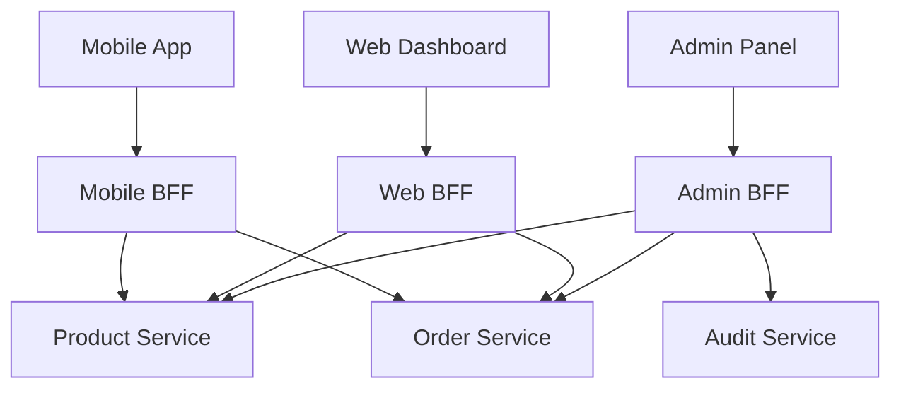

# BFF — Backend-For-Frontend Pattern

## Why BFF

A mobile app needs less data than a web dashboard. An internal admin panel needs different fields than a customer app. One monolithic API cannot serve all frontends well. A BFF is a dedicated backend for each frontend type.



## Approaches Compared

| Approach | Best For |
|----------|----------|
| Normal Spring Boot BFF | Full control, complex aggregation logic |
| Spring WebFlux BFF | High concurrency, parallel downstream calls |
| Spring Cloud Gateway BFF | Simple routing, minimal custom logic |
| GraphQL Federation | Client-driven queries, multiple GraphQL subgraphs |

## Approach 1: Normal Spring Boot BFF

```java
@RestController
@RequestMapping("/api/mobile/dashboard")
@RequiredArgsConstructor
public class MobileDashboardController {
    private final UserClient userClient;
    private final OrderClient orderClient;
    private final RecommendationClient recClient;

    @GetMapping
    public MobileDashboard getDashboard(@AuthenticationPrincipal Jwt jwt) {
        var userId = jwt.getSubject();
        var user = userClient.getProfile(userId);
        var recentOrders = orderClient.getRecent(userId, 5);
        var recommendations = recClient.getForUser(userId, 3);
        return new MobileDashboard(
            user.name(), user.avatarUrl(),
            recentOrders, recommendations);
    }
}

public record MobileDashboard(
    String userName, String avatarUrl,
    List<OrderSummary> recentOrders,
    List<ProductSummary> recommendations
) {}
```

## Approach 2: Spring WebFlux BFF (Parallel Calls)

```java
@RestController
@RequestMapping("/api/web/dashboard")
@RequiredArgsConstructor
public class WebDashboardController {
    private final WebClient webClient;

    @GetMapping
    public Mono<WebDashboard> getDashboard(@AuthenticationPrincipal Jwt jwt) {
        var userId = jwt.getSubject();
        var profile = webClient.get()
            .uri("/api/users/{id}/profile", userId)
            .retrieve().bodyToMono(UserProfile.class);
        var orders = webClient.get()
            .uri("/api/orders?userId={id}&page=0&size=20", userId)
            .retrieve().bodyToMono(new ParameterizedTypeReference<Page<Order>>() {});
        var stats = webClient.get()
            .uri("/api/analytics/user/{id}/stats", userId)
            .retrieve().bodyToMono(UserStats.class);

        return Mono.zip(profile, orders, stats)
            .map(tuple -> new WebDashboard(
                tuple.getT1(), tuple.getT2(), tuple.getT3()));
    }
}
```

## Approach 3: Spring Cloud Gateway as BFF

```yaml
# application.yml — mobile BFF gateway
spring:
  cloud:
    gateway:
      routes:
        - id: mobile-products
          uri: http://product-service:8080
          predicates:
            - Path=/api/mobile/products/**
          filters:
            - RewritePath=/api/mobile/(?<segment>.*), /api/${segment}
            - AddRequestHeader=X-Client-Type, mobile
            - name: RequestRateLimiter
              args:
                redis-rate-limiter.replenishRate: 50
                redis-rate-limiter.burstCapacity: 100
        - id: mobile-orders
          uri: http://order-service:8081
          predicates:
            - Path=/api/mobile/orders/**
          filters:
            - RewritePath=/api/mobile/(?<segment>.*), /api/${segment}
```

## Approach 4: GraphQL Federation (DGS + Spring GraphQL)

```java
@Controller
@RequiredArgsConstructor
public class FederatedProductResolver {
    private final ProductService productService;

    @QueryMapping
    public Product product(@Argument Long id) {
        return productService.findById(id);
    }

    @SchemaMapping(typeName = "Order", field = "product")
    public Product resolveProduct(Order order) {
        return productService.findById(order.getProductId());
    }
}
```

Each service exposes its own GraphQL schema. The federation gateway stitches them together. The frontend queries one endpoint and gets data from multiple services in a single request.

## Key Points

- Each frontend gets its own BFF with tailored responses
- Normal Spring Boot BFF: simplest, full control, easy to test
- WebFlux BFF: best when calling many downstream services in parallel
- Gateway BFF: thin layer, good when you just need routing and filtering
- GraphQL Federation: best for complex data graphs with many client types
