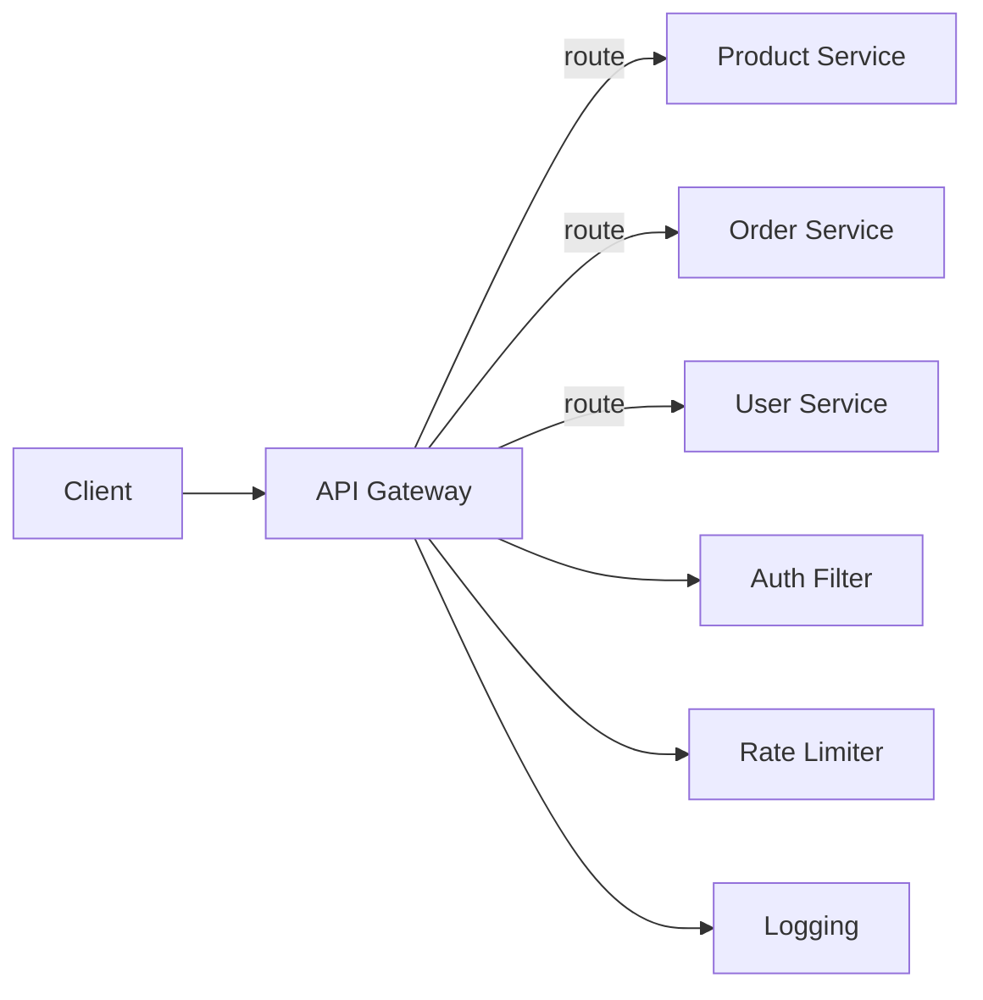

# API Gateway — Spring Cloud Gateway

## Why a Gateway

Without a gateway, clients call each service directly. This means: CORS configuration per service, auth checks in every service, no centralized rate limiting, and clients must know every service URL.

A gateway is the single entry point. It handles cross-cutting concerns once.



## Step 1: Add Dependency

```xml
<dependency>
    <groupId>org.springframework.cloud</groupId>
    <artifactId>spring-cloud-starter-gateway</artifactId>
</dependency>
```

## Step 2: Route Configuration (YAML)

```yaml
server:
  port: 8080

spring:
  cloud:
    gateway:
      routes:
        - id: product-service
          uri: http://product-service:8081
          predicates:
            - Path=/api/products/**
          filters:
            - name: CircuitBreaker
              args:
                name: productCircuitBreaker
                fallbackUri: forward:/fallback/products

        - id: order-service
          uri: http://order-service:8082
          predicates:
            - Path=/api/orders/**
          filters:
            - name: RequestRateLimiter
              args:
                redis-rate-limiter.replenishRate: 100
                redis-rate-limiter.burstCapacity: 200
                key-resolver: "#{@userKeyResolver}"

        - id: user-service
          uri: http://user-service:8083
          predicates:
            - Path=/api/users/**
            - Method=GET
          filters:
            - AddResponseHeader=X-Response-Source, gateway

      default-filters:
        - AddRequestHeader=X-Gateway-Timestamp, ${java.time.Instant.now()}
```

## Step 3: Custom Auth Filter

```java
@Component
@RequiredArgsConstructor
public class JwtAuthFilter implements GlobalFilter, Ordered {
    private final JwtValidator jwtValidator;

    @Override
    public Mono<Void> filter(ServerWebExchange exchange,
            GatewayFilterChain chain) {
        var path = exchange.getRequest().getPath().value();
        if (isPublicPath(path)) {
            return chain.filter(exchange);
        }

        var authHeader = exchange.getRequest().getHeaders()
            .getFirst("Authorization");
        if (authHeader == null || !authHeader.startsWith("Bearer ")) {
            exchange.getResponse().setStatusCode(HttpStatus.UNAUTHORIZED);
            return exchange.getResponse().setComplete();
        }

        var token = authHeader.substring(7);
        try {
            var claims = jwtValidator.validate(token);
            var mutatedRequest = exchange.getRequest().mutate()
                .header("X-User-Id", claims.getSubject())
                .header("X-User-Roles", String.join(",",
                    claims.get("roles", List.class)))
                .build();
            return chain.filter(exchange.mutate()
                .request(mutatedRequest).build());
        } catch (JwtException e) {
            exchange.getResponse().setStatusCode(HttpStatus.UNAUTHORIZED);
            return exchange.getResponse().setComplete();
        }
    }

    private boolean isPublicPath(String path) {
        return path.startsWith("/api/auth/login")
            || path.startsWith("/api/auth/register")
            || path.startsWith("/actuator");
    }

    @Override
    public int getOrder() { return -1; }
}
```

## Step 4: Rate Limiter Key Resolver

```java
@Configuration
public class GatewayConfig {
    @Bean
    public KeyResolver userKeyResolver() {
        return exchange -> {
            var userId = exchange.getRequest().getHeaders()
                .getFirst("X-User-Id");
            return Mono.just(userId != null ? userId : "anonymous");
        };
    }
}
```

## Step 5: Fallback Controller

```java
@RestController
@RequestMapping("/fallback")
public class FallbackController {
    @GetMapping("/products")
    public ResponseEntity<Map<String, String>> productsFallback() {
        return ResponseEntity.status(HttpStatus.SERVICE_UNAVAILABLE)
            .body(Map.of("error", "Product service unavailable",
                "status", "503"));
    }
}
```

## When Gateway vs Direct Service Calls

| Gateway | Direct |
|---------|--------|
| Microservices architecture | Monolith or few services |
| Need centralized auth, rate limiting, logging | Services handle their own concerns |
| Multiple client types (mobile, web, API) | Single client type |
| Service routing changes frequently | Static endpoints |

## Key Points

- Gateway handles cross-cutting concerns once: auth, rate limiting, logging, CORS
- Spring Cloud Gateway is reactive (Netty-based) — designed for high throughput
- Use predicates for routing (path, method, header), filters for transformation
- Circuit breakers at the gateway protect downstream services from cascading failures
- Rate limiting per user prevents any single client from overwhelming your system
