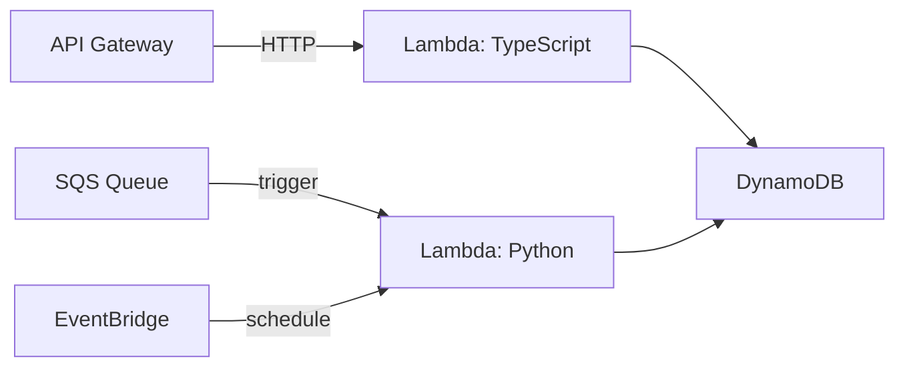

# Serverless — TypeScript (AWS Lambda) + Python

## When Serverless

| Serverless | Container |
|------------|-----------|
| Event-driven, intermittent traffic | Constant, predictable traffic |
| Pay per invocation | Pay for running containers |
| Auto-scale to zero | Always-on baseline |
| Cold start latency concern | No cold starts |

Spring Boot on Lambda has 2-5 second cold starts. TypeScript and Python are the actual tools people use for serverless — sub-second cold starts, native AWS SDK, small bundle sizes.

## Architecture

> **Diagram:** Serverless architecture with API Gateway triggering a TypeScript Lambda, SQS Queue and EventBridge triggering a Python Lambda, both writing to DynamoDB.



## Part 1: TypeScript — HTTP API Lambda

### Step 1: Project Setup

```bash
mkdir product-api && cd product-api
npm init -y
npm install @aws-sdk/client-dynamodb @aws-sdk/lib-dynamodb
npm install -D @types/node typescript esbuild
```

```json
// tsconfig.json
{
  "compilerOptions": {
    "target": "ES2022",
    "module": "ES2022",
    "moduleResolution": "node",
    "outDir": "dist",
    "strict": true,
    "esModuleInterop": true
  },
  "include": ["src"]
}
```

### Step 2: Product Repository

```typescript
// src/repository.ts
import {
  DynamoDBClient,
  GetItemCommand,
  PutItemCommand,
  ScanCommand,
  DeleteItemCommand,
} from "@aws-sdk/client-dynamodb";
import { marshall, unmarshall } from "@aws-sdk/lib-dynamodb";

const client = new DynamoDBClient({});
const TABLE = process.env.PRODUCTS_TABLE!;

export interface Product {
  id: string;
  name: string;
  price: number;
  category: string;
  stock: number;
}

export async function getProduct(id: string): Promise<Product | null> {
  const result = await client.send(
    new GetItemCommand({
      TableName: TABLE,
      Key: marshall({ id }),
    })
  );
  return result.Item ? (unmarshall(result.Item) as Product) : null;
}

export async function putProduct(product: Product): Promise<Product> {
  await client.send(
    new PutItemCommand({
      TableName: TABLE,
      Item: marshall(product),
    })
  );
  return product;
}

export async function listProducts(): Promise<Product[]> {
  const result = await client.send(
    new ScanCommand({ TableName: TABLE })
  );
  return (result.Items ?? []).map((item) => unmarshall(item) as Product);
}

export async function deleteProduct(id: string): Promise<void> {
  await client.send(
    new DeleteItemCommand({
      TableName: TABLE,
      Key: marshall({ id }),
    })
  );
}
```

### Step 3: Lambda Handler

```typescript
// src/handler.ts
import { APIGatewayProxyEventV2, APIGatewayProxyResultV2 } from "aws-lambda";
import { getProduct, putProduct, listProducts, deleteProduct, Product } from "./repository";

export async function handler(
  event: APIGatewayProxyEventV2
): Promise<APIGatewayProxyResultV2> {
  const method = event.requestContext.http.method;
  const path = event.rawPath;

  try {
    if (method === "GET" && path === "/products") {
      const products = await listProducts();
      return { statusCode: 200, body: JSON.stringify(products) };
    }

    if (method === "GET" && path.startsWith("/products/")) {
      const id = path.split("/")[2];
      const product = await getProduct(id);
      if (!product) {
        return { statusCode: 404, body: JSON.stringify({ error: "Not found" }) };
      }
      return { statusCode: 200, body: JSON.stringify(product) };
    }

    if (method === "POST" && path === "/products") {
      const product: Product = JSON.parse(event.body!);
      product.id = crypto.randomUUID();
      const saved = await putProduct(product);
      return { statusCode: 201, body: JSON.stringify(saved) };
    }

    if (method === "DELETE" && path.startsWith("/products/")) {
      const id = path.split("/")[2];
      await deleteProduct(id);
      return { statusCode: 204, body: "" };
    }

    return { statusCode: 404, body: JSON.stringify({ error: "Route not found" }) };
  } catch (err) {
    console.error(err);
    return { statusCode: 500, body: JSON.stringify({ error: "Internal error" }) };
  }
}
```

### Step 4: Build and Bundle

```bash
npx esbuild src/handler.ts --bundle --platform=node --target=node20 \
  --outdir=dist --minify
```

Single file output, ~50KB zipped. Compare: Spring Boot Lambda = ~50MB.

### Step 5: Terraform Deployment

```terraform
resource "aws_lambda_function" "product_api" {
  function_name = "product-api"
  handler       = "handler.handler"
  runtime       = "nodejs20.x"
  filename      = "dist/handler.zip"
  source_code_hash = filebase64sha256("dist/handler.zip")
  memory_size   = 256
  timeout       = 10

  environment {
    variables = {
      PRODUCTS_TABLE = aws_dynamodb_table.products.name
    }
  }
}

resource "aws_apigatewayv2_api" "api" {
  name          = "product-api"
  protocol_type = "HTTP"
}

resource "aws_apigatewayv2_integration" "lambda" {
  api_id           = aws_apigatewayv2_api.api.id
  integration_type = "AWS_PROXY"
  integration_uri  = aws_lambda_function.product_api.invoke_arn
}

resource "aws_apigatewayv2_route" "any" {
  api_id    = aws_apigatewayv2_api.api.id
  route_key = "$default"
  target    = "integrations/${aws_apigatewayv2_integration.lambda.id}"
}
```

## Part 2: Python — SQS Event Processor

### Step 1: Project Setup

```bash
mkdir order-processor && cd order-processor
pip install boto3 aws-lambda-powertools
```

### Step 2: SQS Consumer Lambda

```python
# handler.py
import json
import boto3
from aws_lambda_powertools import Logger
from aws_lambda_powertools.utilities.batch import BatchProcessor, EventType
from aws_lambda_powertools.utilities.typing import LambdaContext

logger = Logger()
dynamodb = boto3.resource("dynamodb")
table = dynamodb.Table(process.env["ORDERS_TABLE"])
sns = boto3.client("sns")
NOTIFICATION_TOPIC = process.env["NOTIFICATION_TOPIC"]

@logger.inject_lambda_context
def handler(event: dict, context: LambdaContext):
    processor = BatchProcessor(event_type=EventType.SQSMessage)
    batch = event["Records"]

    with processor(records=batch, handler=process_order):
        result = processor.process()

    return result.response

def process_order(record: dict):
    body = json.loads(record["body"])
    order_id = body["orderId"]
    action = body["action"]

    if action == "CREATE":
        table.put_item(Item={
            "orderId": order_id,
            "customerId": body["customerId"],
            "total": body["total"],
            "status": "PROCESSING",
        })
        logger.info("Order created", order_id=order_id)

    elif action == "CANCEL":
        table.update_item(
            Key={"orderId": order_id},
            UpdateExpression="SET #s = :status",
            ExpressionAttributeNames={"#s": "status"},
            ExpressionAttributeValues={":status": "CANCELLED"},
        )
        logger.info("Order cancelled", order_id=order_id)

    sns.publish(
        TopicArn=NOTIFICATION_TOPIC,
        Message=json.dumps({"orderId": order_id, "action": action}),
    )
```

Lambda Powertools `BatchProcessor` handles partial failures: if one message in a batch fails, only that message goes back to the queue. The rest succeed.

### Step 3: Terraform Deployment

```terraform
resource "aws_lambda_function" "order_processor" {
  function_name = "order-processor"
  handler       = "handler.handler"
  runtime       = "python3.12"
  filename      = "function.zip"
  memory_size   = 256
  timeout       = 30

  environment {
    variables = {
      ORDERS_TABLE       = aws_dynamodb_table.orders.name
      NOTIFICATION_TOPIC = aws_sns_topic.notifications.arn
    }
  }
}

resource "aws_lambda_event_source_mapping" "sqs_trigger" {
  function_name    = aws_lambda_function.order_processor.arn
  event_source_arn = aws_sqs_queue.order_events.arn
  batch_size       = 10
  maximum_batching_window_in_seconds = 5
}
```

## Part 3: Scheduled Lambda (Python)

```python
# cleanup_handler.py
import boto3
from datetime import datetime, timedelta
from aws_lambda_powertools import Logger

logger = Logger()
dynamodb = boto3.resource("dynamodb")
table = dynamodb.Table(process.env["SESSIONS_TABLE"])

def handler(event, context):
    cutoff = (datetime.utcnow() - timedelta(days=30)).isoformat()

    response = table.scan(
        FilterExpression="createdAt < :cutoff",
        ExpressionAttributeValues={":cutoff": cutoff},
    )

    deleted = 0
    for item in response["Items"]:
        table.delete_item(Key={"sessionId": item["sessionId"]})
        deleted += 1

    logger.info(f"Cleanup complete: {deleted} expired sessions removed")
    return {"deleted": deleted}
```

```terraform
resource "aws_cloudwatch_event_rule" "nightly_cleanup" {
  name                = "nightly-cleanup"
  schedule_expression = "cron(0 2 * * ? *)"
}

resource "aws_cloudwatch_event_target" "cleanup" {
  rule      = aws_cloudwatch_event_rule.nightly_cleanup.name
  target_id = "CleanupLambda"
  arn       = aws_lambda_function.cleanup.arn
}
```

## Cold Start Comparison

| Runtime | Cold Start | Bundle Size |
|---------|-----------|-------------|
| Node.js 20 (TypeScript) | ~200ms | ~1 MB |
| Python 3.12 | ~100ms | ~500 KB |
| Java 21 (Spring Boot) | 2-5s (200ms with SnapStart) | ~50 MB |

## Key Points

- Use TypeScript for HTTP APIs — fast cold starts, type-safe, AWS SDK v3 is modular
- Use Python for event processors — Lambda Powertools handles batch processing, retries, and observability
- Use SQS triggers for async processing, API Gateway for HTTP, EventBridge for schedules
- Keep Lambda functions small and focused — one function per concern
- Serverless is for event-driven, intermittent workloads — containers for always-on services
