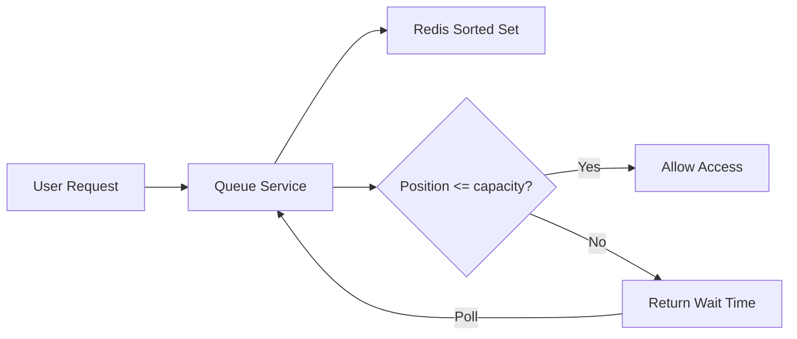

# Virtual Waiting Queue — Protect Systems During Traffic Spikes

## Why Virtual Queues

A flash sale launches. 100,000 users hit "buy" in 10 seconds. Your database handles 1,000 concurrent connections. Without a queue, the system crashes and nobody gets tickets.

A virtual waiting queue controls the flow: users get a position, wait their turn, and enter the system when capacity is available.

> **Diagram:** User requests enter a Queue Service backed by Redis Sorted Sets; if position is within capacity, access is granted, otherwise a wait time is returned and the client polls again.



## Step 1: Redis-Based Position Tracking

```java
@Service
@RequiredArgsConstructor
public class VirtualQueueService {
    private final StringRedisTemplate redis;
    private static final String QUEUE_KEY = "waiting-queue";
    private static final String ACTIVE_KEY = "active-users";
    private static final int MAX_ACTIVE = 500;

    public QueuePosition enterQueue(String userId, String eventId) {
        var queueKey = QUEUE_KEY + ":" + eventId;
        var activeKey = ACTIVE_KEY + ":" + eventId;
        var score = System.currentTimeMillis();

        var added = redis.opsForZSet()
            .addIfAbsent(queueKey, userId, score);
        if (Boolean.FALSE.equals(added)) {
            return getPosition(userId, eventId);
        }

        return promoteIfNeeded(userId, eventId, queueKey, activeKey);
    }

    public QueuePosition getPosition(String userId, String eventId) {
        var queueKey = QUEUE_KEY + ":" + eventId;
        var activeKey = ACTIVE_KEY + ":" + eventId;

        var isActive = redis.opsForSet()
            .isMember(activeKey, userId);
        if (Boolean.TRUE.equals(isActive)) {
            return new QueuePosition(0, 0, "ACTIVE",
                Duration.ZERO, Instant.now());
        }

        var rank = redis.opsForZSet().rank(queueKey, userId);
        if (rank == null) {
            return enterQueue(userId, eventId);
        }

        var activeCount = redis.opsForSet().size(activeKey);
        var effectivePosition = rank - (MAX_ACTIVE - (activeCount != null
            ? activeCount.intValue() : 0));
        var waitTime = estimateWaitTime(Math.max(0, effectivePosition));

        return new QueuePosition(
            rank.intValue(),
            Math.max(0, effectivePosition),
            "WAITING",
            waitTime,
            Instant.now()
        );
    }

    private QueuePosition promoteIfNeeded(String userId, String eventId,
            String queueKey, String activeKey) {
        var activeCount = redis.opsForSet().size(activeKey);
        if (activeCount == null || activeCount < MAX_ACTIVE) {
            redis.opsForSet().add(activeKey, userId);
            redis.opsForZSet().remove(queueKey, userId);
            return new QueuePosition(0, 0, "ACTIVE",
                Duration.ZERO, Instant.now());
        }
        return getPosition(userId, eventId);
    }

    public void releaseSlot(String userId, String eventId) {
        var activeKey = ACTIVE_KEY + ":" + eventId;
        redis.opsForSet().remove(activeKey, userId);
    }

    private Duration estimateWaitTime(int position) {
        var secondsPerTurn = 5;
        return Duration.ofSeconds((long) position * secondsPerTurn);
    }

    @Scheduled(fixedRate = 5000)
    public void promoteUsers() {
        var events = redis.keys(QUEUE_KEY + ":*");
        if (events == null) return;
        for (var queueKey : events) {
            var eventId = queueKey.split(":")[1];
            var activeKey = ACTIVE_KEY + ":" + eventId;
            var activeCount = redis.opsForSet().size(activeKey);
            var toPromote = MAX_ACTIVE -
                (activeCount != null ? activeCount.intValue() : 0);
            if (toPromote <= 0) continue;
            var users = redis.opsForZSet()
                .range(queueKey, 0, toPromote - 1);
            if (users != null) {
                for (var userId : users) {
                    redis.opsForSet().add(activeKey, userId);
                    redis.opsForZSet().remove(queueKey, userId);
                }
            }
        }
    }
}

public record QueuePosition(
    int rank, int effectivePosition,
    String status, Duration estimatedWait,
    Instant timestamp
) {}
```

## Step 2: Controller (Poll-Based Architecture)

```java
@RestController
@RequestMapping("/api/queue")
@RequiredArgsConstructor
public class QueueController {
    private final VirtualQueueService queueService;

    @PostMapping("/enter")
    public ResponseEntity<QueuePosition> enter(
            @RequestParam String eventId,
            @AuthenticationPrincipal Jwt jwt) {
        return ResponseEntity.ok(
            queueService.enterQueue(jwt.getSubject(), eventId));
    }

    @GetMapping("/position")
    public ResponseEntity<QueuePosition> position(
            @RequestParam String eventId,
            @AuthenticationPrincipal Jwt jwt) {
        return ResponseEntity.ok(
            queueService.getPosition(jwt.getSubject(), eventId));
    }

    @PostMapping("/release")
    public ResponseEntity<Void> release(
            @RequestParam String eventId,
            @AuthenticationPrincipal Jwt jwt) {
        queueService.releaseSlot(jwt.getSubject(), eventId);
        return ResponseEntity.ok().build();
    }
}
```

## Step 3: Gateway Filter for Access Control

```java
@Component
public class QueueEnforcementFilter implements GlobalFilter, Ordered {
    private final VirtualQueueService queueService;

    @Override
    public Mono<Void> filter(ServerWebExchange exchange,
            GatewayFilterChain chain) {
        var path = exchange.getRequest().getPath().value();
        if (!path.startsWith("/api/tickets/")) {
            return chain.filter(exchange);
        }
        var userId = exchange.getRequest().getHeaders()
            .getFirst("X-User-Id");
        var eventId = exchange.getRequest().getQueryParams()
            .getFirst("eventId");
        var position = queueService.getPosition(userId, eventId);
        if (!"ACTIVE".equals(position.status())) {
            exchange.getResponse().setStatusCode(
                HttpStatus.TOO_MANY_REQUESTS);
            return exchange.getResponse().setComplete();
        }
        return chain.filter(exchange);
    }

    @Override
    public int getOrder() { return 0; }
}
```

## Key Points

- Redis sorted sets provide O(log N) rank lookups — fast even with millions of users
- Poll-based: clients check their position every 3-5 seconds
- Promote users from waiting to active on a scheduled basis
- Always call `releaseSlot` when a user completes their purchase or times out
- Gateway enforcement ensures users cannot bypass the queue
