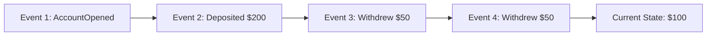

# Event Sourcing — Store Events, Not Current State

> **Last verified:** June 2026 — Axon 4.9.0

## The Concept

Traditional: store the current state (balance = $100). Event sourcing: store every event that led to the current state (deposited $200, withdrew $50, withdrew $50). The current state is derived by replaying events.



## Why Event Sourcing

| Benefit | Why |
|---------|-----|
| Audit trail | Every state change is recorded |
| Time travel | Rebuild state at any point in time |
| Debugging | See exactly what happened and when |
| Event-driven | Events are the integration mechanism |

## Step 1: Axon Framework Setup

```xml
<dependency>
    <groupId>org.axonframework</groupId>
    <artifactId>axon-spring-boot-starter</artifactId>
    <version>4.9.0</version>
</dependency>
```

## Step 2: Define Events

```java
public record BankAccountCreatedEvent(
    UUID accountId, String owner, BigDecimal initialBalance
) {}

public record MoneyDepositedEvent(
    UUID accountId, BigDecimal amount, Instant timestamp
) {}

public record MoneyWithdrawnEvent(
    UUID accountId, BigDecimal amount, Instant timestamp
) {}

public record AccountClosedEvent(
    UUID accountId, String reason
) {}
```

Events are immutable records of things that happened. They are never modified.

## Step 3: Define Commands

```java
public record CreateAccountCommand(
    @TargetAggregateIdentifier UUID accountId,
    String owner, BigDecimal initialBalance
) {}

public record DepositMoneyCommand(
    @TargetAggregateIdentifier UUID accountId,
    BigDecimal amount
) {}

public record WithdrawMoneyCommand(
    @TargetAggregateIdentifier UUID accountId,
    BigDecimal amount
) {}
```

Commands are intentions. They can be rejected. Events are facts — they already happened.

## Step 4: Aggregate (Event Handler + State)

```java
@Aggregate
public class BankAccount {
    @AggregateIdentifier
    private UUID id;
    private String owner;
    private BigDecimal balance;
    private boolean active;

    protected BankAccount() {}

    @CommandHandler
    public BankAccount(CreateAccountCommand cmd) {
        apply(new BankAccountCreatedEvent(
            cmd.accountId(), cmd.owner(), cmd.initialBalance()));
    }

    @CommandHandler
    public void handle(DepositMoneyCommand cmd) {
        if (!active) throw new IllegalStateException("Account closed");
        if (cmd.amount().compareTo(BigDecimal.ZERO) <= 0)
            throw new IllegalArgumentException("Amount must be positive");
        apply(new MoneyDepositedEvent(
            cmd.accountId(), cmd.amount(), Instant.now()));
    }

    @CommandHandler
    public void handle(WithdrawMoneyCommand cmd) {
        if (!active) throw new IllegalStateException("Account closed");
        if (cmd.amount().compareTo(balance) > 0)
            throw new IllegalStateException("Insufficient funds");
        apply(new MoneyWithdrawnEvent(
            cmd.accountId(), cmd.amount(), Instant.now()));
    }

    @EventSourcingHandler
    public void on(BankAccountCreatedEvent event) {
        this.id = event.accountId();
        this.owner = event.owner();
        this.balance = event.initialBalance();
        this.active = true;
    }

    @EventSourcingHandler
    public void on(MoneyDepositedEvent event) {
        this.balance = this.balance.add(event.amount());
    }

    @EventSourcingHandler
    public void on(MoneyWithdrawnEvent event) {
        this.balance = this.balance.subtract(event.amount());
    }

    @EventSourcingHandler
    public void on(AccountClosedEvent event) {
        this.active = false;
    }
}
```

The `@EventSourcingHandler` methods rebuild state from events. When Axon loads an aggregate, it reads all events from the event store and applies them in order.

## Step 5: REST API

```java
@RestController
@RequestMapping("/api/accounts")
@RequiredArgsConstructor
public class BankAccountController {
    private final CommandGateway commandGateway;

    @PostMapping
    public ResponseEntity<String> create(@RequestBody CreateAccountRequest req) {
        var id = UUID.randomUUID();
        commandGateway.sendAndWait(new CreateAccountCommand(
            id, req.owner(), req.initialBalance()));
        return ResponseEntity.status(HttpStatus.CREATED).body(id.toString());
    }

    @PostMapping("/{id}/deposit")
    public ResponseEntity<Void> deposit(@PathVariable UUID id,
            @RequestBody DepositRequest req) {
        commandGateway.sendAndWait(
            new DepositMoneyCommand(id, req.amount()));
        return ResponseEntity.ok().build();
    }

    @PostMapping("/{id}/withdraw")
    public ResponseEntity<Void> withdraw(@PathVariable UUID id,
            @RequestBody WithdrawRequest req) {
        commandGateway.sendAndWait(
            new WithdrawMoneyCommand(id, req.amount()));
        return ResponseEntity.ok().build();
    }
}
```

## Key Points

- Events are the source of truth — the database stores events, not current state
- State is rebuilt by replaying events from the beginning
- Events are immutable — never change or delete an event
- Use snapshots to avoid replaying thousands of events on every load
- Axon Framework handles the event store, command bus, and event replay mechanics
