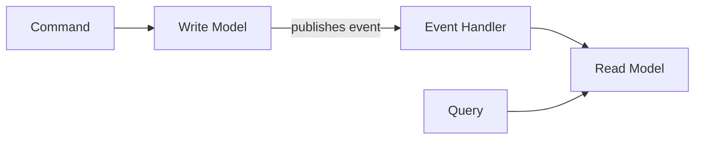

# CQRS — Separate Read Model from Write Model

## The Problem

A single database model optimized for writes (normalized, transactional) is slow for reads (denormalized, aggregated). CQRS separates the two: different models, different databases, optimized independently.



## Why CQRS

| Write Model | Read Model |
|-------------|------------|
| Normalized, consistent | Denormalized, fast |
| Complex validation | Simple lookups |
| Transactional database | Search engine, cache, read replica |

## Step 1: Axon Framework CQRS Setup

```xml
<dependency>
    <groupId>org.axonframework</groupId>
    <artifactId>axon-spring-boot-starter</artifactId>
    <version>4.9.0</version>
</dependency>
```

## Step 2: Write Side (Commands and Aggregate)

```java
public record CreateOrderCommand(
    @TargetAggregateIdentifier UUID orderId,
    String customerId, List<OrderLine> lines
) {}

public record ConfirmOrderCommand(
    @TargetAggregateIdentifier UUID orderId
) {}

public record OrderCreatedEvent(
    UUID orderId, String customerId,
    List<OrderLine> lines, BigDecimal total,
    Instant createdAt
) {}

public record OrderConfirmedEvent(
    UUID orderId, Instant confirmedAt
) {}

@Aggregate
public class Order {
    @AggregateIdentifier private UUID id;
    private String status;

    protected Order() {}

    @CommandHandler
    public Order(CreateOrderCommand cmd) {
        var total = cmd.lines().stream()
            .map(l -> l.price().multiply(BigDecimal.valueOf(l.quantity())))
            .reduce(BigDecimal.ZERO, BigDecimal::add);
        apply(new OrderCreatedEvent(
            cmd.orderId(), cmd.customerId(),
            cmd.lines(), total, Instant.now()));
    }

    @CommandHandler
    public void handle(ConfirmOrderCommand cmd) {
        if (!"CREATED".equals(status))
            throw new IllegalStateException("Cannot confirm");
        apply(new OrderConfirmedEvent(cmd.orderId(), Instant.now()));
    }

    @EventSourcingHandler
    public void on(OrderCreatedEvent event) {
        this.id = event.orderId();
        this.status = "CREATED";
    }

    @EventSourcingHandler
    public void on(OrderConfirmedEvent event) {
        this.status = "CONFIRMED";
    }
}
```

## Step 3: Read Side (Projection)

```java
@Entity
@Table(name = "order_summary")
public class OrderSummary {
    @Id private UUID orderId;
    private String customerId;
    private BigDecimal total;
    private String status;
    private int itemCount;
    private Instant createdAt;
    private Instant confirmedAt;
}
```

```java
@Component
@RequiredArgsConstructor
public class OrderProjection {
    private final OrderSummaryRepository repository;

    @EventHandler
    public void on(OrderCreatedEvent event) {
        var summary = new OrderSummary();
        summary.setOrderId(event.orderId());
        summary.setCustomerId(event.customerId());
        summary.setTotal(event.total());
        summary.setItemCount(event.lines().size());
        summary.setStatus("CREATED");
        summary.setCreatedAt(event.createdAt());
        repository.save(summary);
    }

    @EventHandler
    public void on(OrderConfirmedEvent event) {
        var summary = repository.findById(event.orderId())
            .orElseThrow();
        summary.setStatus("CONFIRMED");
        summary.setConfirmedAt(event.confirmedAt());
        repository.save(summary);
    }
}
```

## Step 4: Query Side

```java
public record FindOrderQuery(UUID orderId) {}
public record FindOrdersByCustomerQuery(String customerId) {}

@Component
@RequiredArgsConstructor
public class OrderQueryHandler {
    private final OrderSummaryRepository repository;

    @QueryHandler
    public OrderSummary handle(FindOrderQuery query) {
        return repository.findById(query.orderId()).orElse(null);
    }

    @QueryHandler
    public List<OrderSummary> handle(FindOrdersByCustomerQuery query) {
        return repository.findByCustomerIdOrderByCreatedAtDesc(
            query.customerId());
    }
}
```

```java
@RestController
@RequestMapping("/api/orders")
@RequiredArgsConstructor
public class OrderController {
    private final CommandGateway commandGateway;
    private final QueryGateway queryGateway;

    @PostMapping
    public ResponseEntity<String> create(
            @RequestBody CreateOrderRequest request) {
        var orderId = UUID.randomUUID();
        commandGateway.sendAndWait(
            new CreateOrderCommand(orderId,
                request.customerId(), request.lines()));
        return ResponseEntity.status(HttpStatus.CREATED)
            .body(orderId.toString());
    }

    @GetMapping("/{id}")
    public ResponseEntity<OrderSummary> get(@PathVariable UUID id) {
        var result = queryGateway.query(
            new FindOrderQuery(id), OrderSummary.class).join();
        return ResponseEntity.ok(result);
    }

    @GetMapping
    public List<OrderSummary> listByCustomer(
            @RequestParam String customerId) {
        return queryGateway.query(
            new FindOrdersByCustomerQuery(customerId),
            ResponseTypes.multipleInstancesOf(OrderSummary.class)).join();
    }
}
```

## Eventual Consistency

The read model is updated asynchronously. There is a brief window where the read model is stale. This is acceptable for most queries. For immediate consistency after a write, query the write model directly.

## Key Points

- Write model handles commands and validation; read model handles queries
- Read model is a denormalized projection optimized for specific queries
- Events bridge the two sides — write model publishes, read model subscribes
- Eventual consistency means reads may be slightly stale — design your UI accordingly
- Use CQRS when read and write patterns differ significantly (complex domains, high read load)
