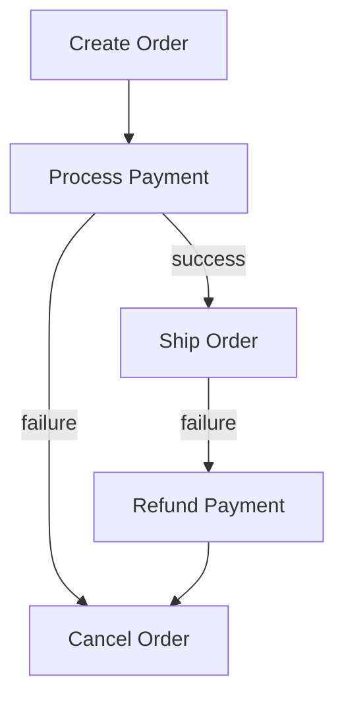

# Saga Pattern — Distributed Transactions Without 2PC

## The Problem

An order spans three services: Order, Payment, and Shipping. In a monolith, one transaction wraps everything. In microservices, each service has its own database. Two-phase commit (2PC) is too slow and brittle.

A saga is a sequence of local transactions. Each service does its part and publishes an event. If any step fails, compensating transactions undo previous steps.

> **Diagram:** Saga flow where Create Order leads to Process Payment, then either Ship Order on success or Cancel Order on failure, with Shipping failure triggering a Refund Payment compensation.



## Orchestration vs Choreography

| Orchestration | Choreography |
|---------------|--------------|
| Central coordinator (saga class) | No coordinator, event-driven |
| Easier to trace and debug | More decentralized |
| Single point of failure | Harder to debug flow |
| Axon Saga, Temporal | Kafka events |

## Step 1: Axon Saga (Orchestration)

```java
public record CreateOrderCommand(UUID orderId, BigDecimal amount) {}
public record ProcessPaymentCommand(UUID orderId, BigDecimal amount) {}
public record ShipOrderCommand(UUID orderId, String address) {}
public record CancelOrderCommand(UUID orderId, String reason) {}
public record RefundPaymentCommand(UUID paymentId, UUID orderId) {}

public record OrderCreatedEvent(UUID orderId, BigDecimal amount) {}
public record PaymentProcessedEvent(UUID orderId, UUID paymentId) {}
public record PaymentFailedEvent(UUID orderId, String reason) {}
public record OrderShippedEvent(UUID orderId) {}
public record ShippingFailedEvent(UUID orderId, String reason) {}
```

## Step 2: Saga Definition

```java
@saga
@RequiredArgsConstructor
public class OrderSaga {
    private final CommandGateway commandGateway;

    @StartSaga
    @SagaEventHandler(associationProperty = "orderId")
    public void handle(OrderCreatedEvent event) {
        commandGateway.send(new ProcessPaymentCommand(
            event.orderId(), event.amount()));
    }

    @SagaEventHandler(associationProperty = "orderId")
    public void handle(PaymentProcessedEvent event) {
        commandGateway.send(new ShipOrderCommand(
            event.orderId(), "default-address"));
    }

    @SagaEventHandler(associationProperty = "orderId")
    public void handle(PaymentFailedEvent event) {
        commandGateway.send(new CancelOrderCommand(
            event.orderId(), "Payment failed: " + event.reason()));
    }

    @SagaEventHandler(associationProperty = "orderId")
    public void handle(OrderShippedEvent event) {
        SagaLifecycle.end();
    }

    @SagaEventHandler(associationProperty = "orderId")
    public void handle(ShippingFailedEvent event) {
        commandGateway.send(new RefundPaymentCommand(
            null, event.orderId()));
        commandGateway.send(new CancelOrderCommand(
            event.orderId(), "Shipping failed: " + event.reason()));
    }

    @EndSaga
    @SagaEventHandler(associationProperty = "orderId")
    public void handle(OrderCancelledEvent event) {
    }
}
```

## How It Works

1. `OrderCreatedEvent` starts the saga. It sends `ProcessPaymentCommand`.
2. If payment succeeds, `PaymentProcessedEvent` triggers `ShipOrderCommand`.
3. If payment fails, `PaymentFailedEvent` triggers `CancelOrderCommand` (compensating action).
4. If shipping fails, `ShippingFailedEvent` triggers refund then cancel (two compensating actions).
5. `OrderShippedEvent` or `OrderCancelledEvent` ends the saga.

## Step 3: Compensating Actions

```java
@Aggregate
public class Order {
    @AggregateIdentifier private UUID id;
    private String status;

    @CommandHandler
    public void handle(CancelOrderCommand cmd) {
        if ("CANCELLED".equals(status)) return;
        apply(new OrderCancelledEvent(cmd.orderId(), cmd.reason()));
    }

    @EventSourcingHandler
    public void on(OrderCancelledEvent event) {
        this.status = "CANCELLED";
    }
}
```

Compensating actions must be idempotent — they might be called multiple times during retries.

## Saga Execution Timeline

```
Happy path:
  CreateOrder → ProcessPayment → ShipOrder → Saga ends

Payment fails:
  CreateOrder → ProcessPayment(fail) → CancelOrder → Saga ends

Shipping fails:
  CreateOrder → ProcessPayment → ShipOrder(fail)
  → RefundPayment → CancelOrder → Saga ends
```

## Key Points

- Sagas replace distributed transactions with a sequence of local transactions
- Each step must have a compensating action for rollback
- Compensating actions must be idempotent — retries happen in distributed systems
- Orchestration (Axon Saga, Temporal) is easier to reason about than choreography
- Use saga when a business process spans multiple services with separate databases
