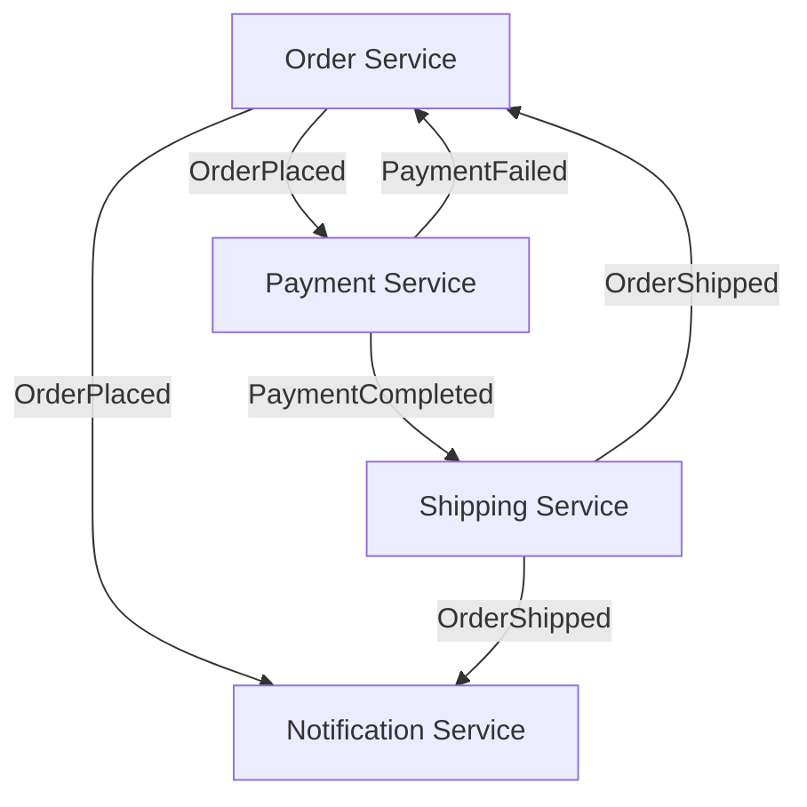

# Choreography — Event-Driven Coordination

## The Pattern

No central coordinator. Each service publishes events when it does something. Other services listen and react. The workflow emerges from independent services reacting to events.



## Choreography vs Orchestration

| Choreography | Orchestration |
|--------------|---------------|
| No central coordinator | Central saga/orchestrator |
| Loose coupling | Tighter coupling |
| Harder to trace flow | Clear flow in one place |
| Each service is autonomous | Coordinator manages state |
| Simpler to add new services | Simpler to handle failures |

## Step 1: Order Service (Publisher)

```java
@Service
@RequiredArgsConstructor
public class OrderService {
    private final OrderRepository repository;
    private final KafkaTemplate<String, OrderEvent> kafka;

    public OrderResponse placeOrder(OrderRequest request) {
        var order = new Order();
        order.setCustomerId(request.customerId());
        order.setItems(request.items());
        order.setTotal(calculateTotal(request.items()));
        order.setStatus("PLACED");
        var saved = repository.save(order);

        kafka.send("order-events", String.valueOf(saved.getId()),
            new OrderEvent("ORDER_PLACED", saved.getId(),
                saved.getCustomerId(), saved.getTotal(),
                Instant.now()));
        return new OrderResponse(saved.getId(), saved.getStatus());
    }

    public void markPaid(Long orderId) {
        var order = repository.findById(orderId).orElseThrow();
        order.setStatus("PAID");
        repository.save(order);
        kafka.send("order-events", String.valueOf(orderId),
            new OrderEvent("ORDER_PAID", orderId,
                order.getCustomerId(), order.getTotal(),
                Instant.now()));
    }

    public void markShipped(Long orderId, String trackingId) {
        var order = repository.findById(orderId).orElseThrow();
        order.setStatus("SHIPPED");
        order.setTrackingId(trackingId);
        repository.save(order);
        kafka.send("order-events", String.valueOf(orderId),
            new OrderEvent("ORDER_SHIPPED", orderId,
                order.getCustomerId(), trackingId,
                Instant.now()));
    }

    public void cancel(Long orderId, String reason) {
        var order = repository.findById(orderId).orElseThrow();
        order.setStatus("CANCELLED");
        order.setCancellationReason(reason);
        repository.save(order);
        kafka.send("order-events", String.valueOf(orderId),
            new OrderEvent("ORDER_CANCELLED", orderId,
                order.getCustomerId(), reason,
                Instant.now()));
    }
}
```

## Step 2: Payment Service (Subscriber)

```java
@Component
@RequiredArgsConstructor
@Slf4j
public class PaymentEventConsumer {
    private final PaymentService paymentService;

    @KafkaListener(topics = "order-events", groupId = "payment-service")
    public void handle(OrderEvent event) {
        log.info("Payment received event: {} for order {}",
            event.type(), event.orderId());
        switch (event.type()) {
            case "ORDER_PLACED" ->
                paymentService.processPayment(event);
            case "ORDER_CANCELLED" ->
                paymentService.refund(event.orderId());
        }
    }
}

@Service
@RequiredArgsConstructor
public class PaymentService {
    private final PaymentGateway gateway;
    private final KafkaTemplate<String, PaymentEvent> kafka;

    public void processPayment(OrderEvent orderEvent) {
        try {
            var result = gateway.charge(
                orderEvent.customerId(), orderEvent.total());
            kafka.send("payment-events",
                String.valueOf(orderEvent.orderId()),
                new PaymentEvent("PAYMENT_COMPLETED",
                    orderEvent.orderId(), result.transactionId(),
                    Instant.now()));
        } catch (PaymentException e) {
            kafka.send("payment-events",
                String.valueOf(orderEvent.orderId()),
                new PaymentEvent("PAYMENT_FAILED",
                    orderEvent.orderId(), null,
                    Instant.now()));
        }
    }
}
```

## Step 3: Shipping Service (Subscriber)

```java
@Component
@RequiredArgsConstructor
public class ShippingEventConsumer {
    private final ShippingService shippingService;

    @KafkaListener(topics = "payment-events", groupId = "shipping-service")
    public void handle(PaymentEvent event) {
        if ("PAYMENT_COMPLETED".equals(event.type())) {
            shippingService.scheduleDelivery(event.orderId());
        }
    }
}

@Service
@RequiredArgsConstructor
public class ShippingService {
    private final ShippingClient shippingClient;
    private final KafkaTemplate<String, ShippingEvent> kafka;

    public void scheduleDelivery(Long orderId) {
        var result = shippingClient.createShipment(orderId);
        kafka.send("shipping-events", String.valueOf(orderId),
            new ShippingEvent("ORDER_SHIPPED", orderId,
                result.trackingId(), Instant.now()));
    }
}
```

## Step 4: Order Service (Subscribes to Shipping)

```java
@Component
@RequiredArgsConstructor
public class OrderShippingConsumer {
    private final OrderService orderService;

    @KafkaListener(topics = "shipping-events", groupId = "order-service")
    public void handle(ShippingEvent event) {
        orderService.markShipped(event.orderId(), event.trackingId());
    }
}
```

## The Flow

```
1. Order Service: places order → publishes ORDER_PLACED
2. Payment Service: processes payment → publishes PAYMENT_COMPLETED
3. Shipping Service: ships order → publishes ORDER_SHIPPED
4. Order Service: marks order shipped
5. Notification Service: sends confirmation email
```

No service knows about the others. Each reacts to events it cares about. Adding a new service (e.g., analytics) means subscribing to existing events — no changes to existing services.

## Key Points

- Each service owns its logic and database — no distributed transactions
- Services communicate through events, not API calls
- Adding new subscribers requires zero changes to existing services
- Use correlation IDs to trace a request across services
- Monitor event flow with distributed tracing — choreography is hard to debug without it
