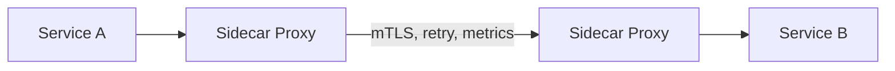

# Service Mesh — Sidecar Proxy Pattern

## The Problem

Microservices need mTLS, retries, circuit breaking, observability, and traffic management. Implementing these in every service means duplicated code and inconsistent behavior. A service mesh moves these concerns to an infrastructure layer.



## How It Works

Each service instance gets a sidecar proxy (Envoy). All network traffic goes through the proxy. The mesh control plane (Istio/Linkerd) configures the proxies.

- **No code changes** in your Spring Boot application
- **mTLS** between services — automatic certificate rotation
- **Traffic management** — canary deployments, A/B testing
- **Observability** — distributed traces, metrics, access logs

## When Service Mesh Is Worth the Complexity

| Use Service Mesh | Skip It |
|-----------------|---------|
| 20+ microservices | < 10 services |
| Cross-cutting security (mTLS) requirements | Simple security needs |
| Complex traffic routing (canary, blue-green) | Basic deployments |
| Polyglot services (Java, Go, Python) | Single language |
| Service-to-service observability required | Application-level observability |

## Istio Traffic Split Example

Deploy two versions of your service and split traffic 90/10 for canary testing:

```yaml
# destination-rule.yaml
apiVersion: networking.istio.io/v1beta1
kind: DestinationRule
metadata:
  name: product-service
spec:
  host: product-service
  subsets:
    - name: v1
      labels:
        version: v1
    - name: v2
      labels:
        version: v2
```

```yaml
# virtual-service.yaml
apiVersion: networking.istio.io/v1beta1
kind: VirtualService
metadata:
  name: product-service
spec:
  hosts:
    - product-service
  http:
    - route:
        - destination:
            host: product-service
            subset: v1
          weight: 90
        - destination:
            host: product-service
            subset: v2
          weight: 10
      retries:
        attempts: 3
        perTryTimeout: 2s
      timeout: 10s
```

90% of traffic goes to v1, 10% to v2. No code changes. No redeployment. Adjust weights and apply.

## Istio Circuit Breaker

```yaml
apiVersion: networking.istio.io/v1beta1
kind: DestinationRule
metadata:
  name: order-service
spec:
  host: order-service
  trafficPolicy:
    connectionPool:
      tcp:
        maxConnections: 100
      http:
        h2UpgradePolicy: DEFAULT
        http1MaxPendingRequests: 100
        http2MaxRequests: 100
    outlierDetection:
      consecutive5xxErrors: 5
      interval: 30s
      baseEjectionTime: 30s
      maxEjectionPercent: 50
```

If an instance returns 5 consecutive 5xx errors within 30 seconds, it is ejected from the load balancer for 30 seconds.

## What You Still Need in Code

A service mesh handles infrastructure concerns. Your application still needs:

- **Business logic retries**: Retry on specific business exceptions (not in the mesh's scope)
- **Application-level circuit breaking**: Resilience4j for business-specific fallbacks
- **Authorization**: The mesh authenticates (mTLS), your app authorizes (RBAC)
- **Input validation**: Always in your code

## Istio Observability (Free Metrics)

When Istio is installed, every service automatically gets:

- Request count, error rate, latency (P50, P95, P99)
- Service dependency graph
- Access logs for every request

No code changes. No Micrometer configuration. The sidecar proxy captures all traffic metrics.

## Key Points

- Service mesh adds a sidecar proxy to handle cross-cutting networking concerns
- Zero code changes in your Spring Boot services
- Use it when you have many services and consistent cross-cutting requirements
- Start with Linkerd (simpler) or Istio (more features)
- It does not replace application-level resilience (Resilience4j) — they complement each other
