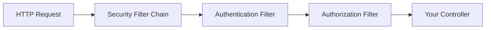

# Auth — Spring Security Fundamentals

## Spring Security Filter Chain

Every request passes through a chain of filters before reaching your controller. Spring Security configures this chain to handle authentication and authorization.

> **Diagram:** HTTP request flowing through Spring Security's filter chain — Authentication Filter then Authorization Filter — before reaching the controller.



## Step 1: Basic Security Setup

```xml
<dependency>
    <groupId>org.springframework.boot</groupId>
    <artifactId>spring-boot-starter-security</artifactId>
</dependency>
```

```java
@Configuration
@EnableWebSecurity
@EnableMethodSecurity
public class SecurityConfig {
    @Bean
    public SecurityFilterChain filterChain(HttpSecurity http) throws Exception {
        return http
            .csrf(csrf -> csrf.disable())
            .sessionManagement(session ->
                session.sessionCreationPolicy(SessionCreationPolicy.STATELESS))
            .authorizeHttpRequests(auth -> auth
                .requestMatchers("/api/auth/**").permitAll()
                .requestMatchers("/actuator/health").permitAll()
                .requestMatchers("/api/admin/**").hasRole("ADMIN")
                .anyRequest().authenticated()
            )
            .httpBasic(Customizer.withDefaults())
            .build();
    }

    @Bean
    public PasswordEncoder passwordEncoder() {
        return new BCryptPasswordEncoder();
    }
}
```

Key decisions:
- **CSRF disabled**: REST APIs use tokens, not sessions
- **Stateless sessions**: No server-side session storage
- **Permit specific paths**: Auth endpoints and health checks are public

## Step 2: Method-Level Security

```java
@Service
public class ProductService {
    @PreAuthorize("hasRole('ADMIN')")
    public ProductResponse create(ProductRequest request) {
        return productRepository.save(toEntity(request));
    }

    @PreAuthorize("hasAnyRole('ADMIN', 'MANAGER')")
    public ProductResponse update(Long id, ProductRequest request) {
        return productRepository.findById(id)
            .map(existing -> update(existing, request))
            .map(productRepository::save)
            .map(this::toResponse)
            .orElseThrow(() -> new ResourceNotFoundException("Not found"));
    }

    @PreAuthorize("isAuthenticated()")
    public Page<ProductResponse> list(Pageable pageable) {
        return productRepository.findAll(pageable).map(this::toResponse);
    }

    @PreAuthorize("hasRole('ADMIN') or #id == authentication.principal.id")
    public ProductResponse get(Long id) {
        return productRepository.findById(id)
            .map(this::toResponse)
            .orElseThrow(() -> new ResourceNotFoundException("Not found"));
    }

    @Secured("ROLE_ADMIN")
    public void delete(Long id) {
        productRepository.deleteById(id);
    }
}
```

`@PreAuthorize` uses SpEL expressions. `@Secured` is simpler but less flexible. Prefer `@PreAuthorize`.

## Step 3: Security Context

```java
@GetMapping("/me")
public ResponseEntity<UserInfo> currentUser(
        @AuthenticationPrincipal UserDetails userDetails) {
    return ResponseEntity.ok(new UserInfo(
        userDetails.getUsername(),
        userDetails.getAuthorities().stream()
            .map(GrantedAuthority::getAuthority)
            .toList()
    ));
}
```

The `@AuthenticationPrincipal` annotation injects the authenticated user. You can also access it programmatically:

```java
var authentication = SecurityContextHolder.getContext().getAuthentication();
var username = authentication.getName();
var roles = authentication.getAuthorities();
```

## Step 4: UserDetailsService

```java
@Service
@RequiredArgsConstructor
public class CustomUserDetailsService implements UserDetailsService {
    private final UserRepository userRepository;

    @Override
    public UserDetails loadUserByUsername(String username)
            throws UsernameNotFoundException {
        var user = userRepository.findByUsername(username)
            .orElseThrow(() -> new UsernameNotFoundException(
                "User not found: " + username));
        return User.builder()
            .username(user.getUsername())
            .password(user.getPassword())
            .roles(user.getRoles().toArray(new String[0]))
            .build();
    }
}
```

## Key Points

- Spring Security is a filter chain — every request passes through it
- Use `SecurityFilterChain` bean (lambda DSL) — no deprecated `WebSecurityConfigurerAdapter`
- `@PreAuthorize` for method-level security with SpEL expressions
- Stateless session management for REST APIs (JWT or basic auth)
- Always hash passwords with `BCryptPasswordEncoder` — never store plain text
