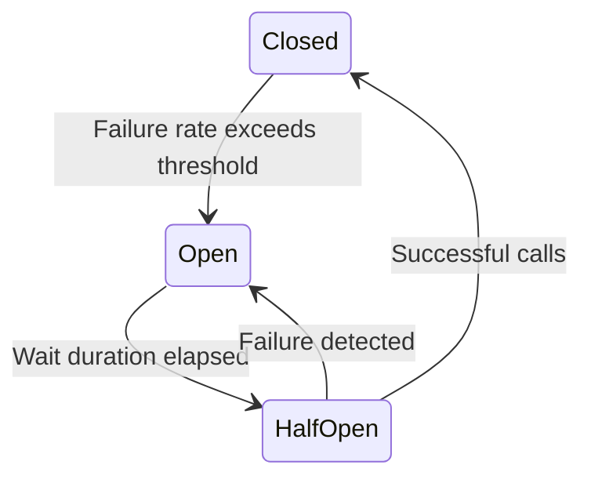

# Circuit Breaker — Resilience4j

> **Last verified:** June 2026 — resilience4j 2.2.0

## The Pattern

A circuit breaker prevents cascading failures. When a downstream service fails repeatedly, the circuit opens — requests fail fast instead of waiting for timeouts.



- **Closed**: Normal operation. Calls go through. Failure rate is tracked.
- **Open**: All calls fail immediately. No requests sent to the failing service.
- **Half-Open**: A few test calls go through. If they succeed, the circuit closes. If they fail, it opens again.

## Step 1: Add Resilience4j

```xml
<dependency>
    <groupId>io.github.resilience4j</groupId>
    <artifactId>resilience4j-spring-boot3</artifactId>
    <version>2.2.0</version>
</dependency>
<dependency>
    <groupId>io.github.resilience4j</groupId>
    <artifactId>resilience4j-reactor</artifactId>
    <version>2.2.0</version>
</dependency>
```

## Step 2: Configuration

```yaml
resilience4j:
  circuitbreaker:
    configs:
      default:
        sliding-window-type: COUNT_BASED
        sliding-window-size: 10
        failure-rate-threshold: 50
        slow-call-duration-threshold: 3s
        slow-call-rate-threshold: 80
        wait-duration-in-open-state: 30s
        permitted-number-of-calls-in-half-open-state: 3
        minimum-number-of-calls: 5
    instances:
      productService:
        base-config: default
        failure-rate-threshold: 60
      paymentService:
        base-config: default
        wait-duration-in-open-state: 60s
```

| Config | Meaning |
|--------|---------|
| `sliding-window-size: 10` | Evaluate last 10 calls |
| `failure-rate-threshold: 50` | Open circuit if >50% fail |
| `wait-duration-in-open-state: 30s` | Stay open for 30 seconds |
| `permitted-number-of-calls-in-half-open-state: 3` | Allow 3 test calls |

## Step 3: Apply to Methods

```java
@Service
@RequiredArgsConstructor
public class OrderAggregationService {
    private final RestClient restClient;

    @CircuitBreaker(name = "productService", fallbackMethod = "productFallback")
    public ProductResponse getProduct(Long productId) {
        return restClient.get()
            .uri("/api/products/{id}", productId)
            .retrieve()
            .body(ProductResponse.class);
    }

    private ProductResponse productFallback(Long productId,
            Throwable throwable) {
        return new ProductResponse(productId, "Unavailable",
            BigDecimal.ZERO, 0);
    }

    @CircuitBreaker(name = "paymentService", fallbackMethod = "paymentFallback")
    public PaymentStatus checkPayment(String transactionId) {
        return restClient.get()
            .uri("/api/payments/{id}/status", transactionId)
            .retrieve()
            .body(PaymentStatus.class);
    }

    private PaymentStatus paymentFallback(String transactionId,
            Throwable throwable) {
        return new PaymentStatus(transactionId, "UNKNOWN",
            "Payment service temporarily unavailable");
    }
}
```

## Step 4: Sliding Window Types

| Type | How It Works |
|------|-------------|
| COUNT_BASED | Evaluates last N calls |
| TIME_BASED | Evaluates calls in last N seconds |

Use COUNT_BASED for services with variable call rates. TIME_BASED for consistent rates.

## Step 5: Monitor Circuit State

```java
@RestController
@RequestMapping("/admin/circuit-breakers")
@RequiredArgsConstructor
public class CircuitBreakerController {
    private final CircuitBreakerRegistry registry;

    @GetMapping
    public List<CircuitBreakerStatus> listAll() {
        return registry.getAllCircuitBreakers().stream()
            .map(cb -> new CircuitBreakerStatus(
                cb.getName(),
                cb.getState().name(),
                cb.getMetrics().getFailureRate(),
                cb.getMetrics().getSuccessfulCalls().count(),
                cb.getMetrics().getFailedCalls().count()))
            .toList();
    }
}
```

Expose circuit breaker state for dashboards and alerting. Alert when a circuit opens — it means a downstream service is failing.

## Key Points

- Circuit breakers prevent cascading failures — fail fast instead of timing out
- Always provide a fallback — return cached data or a degraded response
- Monitor circuit state and alert when circuits open
- Tune `failure-rate-threshold` and `sliding-window-size` per service
- Combine with retry: retry handles transient errors, circuit breaker handles sustained failures
