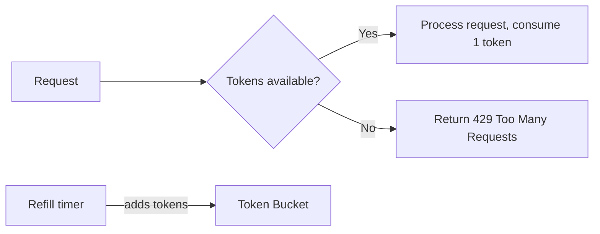

# Rate Limiting — Resilience4j RateLimiter

## Why Rate Limit

Rate limiting protects your service from being overwhelmed. It ensures fair usage across clients and prevents abuse.

## Token Bucket Algorithm

> **Diagram:** Token bucket algorithm where a request checks token availability — if tokens exist the request is processed, otherwise a 429 is returned — while a refill timer periodically adds tokens back to the bucket.



A bucket holds N tokens. Each request consumes one token. Tokens refill at a constant rate. If the bucket is empty, requests are rejected until tokens refill.

## Step 1: Configuration

```yaml
resilience4j:
  ratelimiter:
    configs:
      default:
        limit-for-period: 50
        limit-refresh-period: 1s
        timeout-duration: 0s
    instances:
      registration:
        limit-for-period: 10
        limit-refresh-period: 1m
        timeout-duration: 0s
      api-general:
        limit-for-period: 100
        limit-refresh-period: 1s
        timeout-duration: 5s
```

| Config | Meaning |
|--------|---------|
| `limit-for-period: 50` | Bucket holds 50 tokens |
| `limit-refresh-period: 1s` | Refill 50 tokens every second |
| `timeout-duration: 0s` | Fail immediately when no tokens (vs. wait) |

## Step 2: Apply to Endpoints

```java
@RestController
@RequestMapping("/api")
@RequiredArgsConstructor
public class ApiController {
    private final UserService userService;
    private final AuthService authService;

    @PostMapping("/register")
    @RateLimiter(name = "registration")
    public ResponseEntity<UserResponse> register(
            @Valid @RequestBody RegistrationRequest request) {
        return ResponseEntity.status(HttpStatus.CREATED)
            .body(userService.register(request));
    }

    @GetMapping("/users")
    @RateLimiter(name = "api-general")
    public ResponseEntity<Page<UserResponse>> listUsers(
            Pageable pageable) {
        return ResponseEntity.ok(userService.list(pageable));
    }

    @PostMapping("/login")
    @RateLimiter(name = "registration", fallbackMethod = "loginRateLimited")
    public ResponseEntity<AuthResponse> login(
            @Valid @RequestBody LoginRequest request) {
        return ResponseEntity.ok(authService.login(request));
    }

    private ResponseEntity<AuthResponse> loginRateLimited(
            LoginRequest request, RequestNotPermitted e) {
        return ResponseEntity.status(HttpStatus.TOO_MANY_REQUESTS)
            .header("Retry-After", "60")
            .build();
    }
}
```

## Step 3: Per-User Rate Limiting with Redis

Resilience4j RateLimiter is per-instance. For distributed per-user limits, use Redis:

```java
@Component
@RequiredArgsConstructor
public class RedisRateLimiter {
    private final StringRedisTemplate redis;

    public boolean isAllowed(String clientId, int maxRequests,
            Duration window) {
        var key = "rate-limit:" + clientId;
        var script = """
            local count = redis.call('INCR', KEYS[1])
            if count == 1 then
                redis.call('EXPIRE', KEYS[1], ARGV[1])
            end
            return count
            """;
        var result = redis.execute(
            new DefaultRedisScript<>(script, Long.class),
            List.of(key),
            String.valueOf(window.getSeconds()));
        return result != null && result <= maxRequests;
    }
}
```

```java
@Component
@RequiredArgsConstructor
public class RateLimitFilter extends OncePerRequestFilter {
    private final RedisRateLimiter rateLimiter;

    @Override
    protected void doFilterInternal(HttpServletRequest request,
            HttpServletResponse response, FilterChain chain)
            throws ServletException, IOException {
        var clientId = extractClientId(request);
        if (!rateLimiter.isAllowed(clientId, 100,
                Duration.ofMinutes(1))) {
            response.setStatus(429);
            response.setHeader("Retry-After", "60");
            response.getWriter().write(
                "{\"error\":\"Too many requests\"}");
            return;
        }
        chain.doFilter(request, response);
    }

    private String extractClientId(HttpServletRequest request) {
        var auth = request.getHeader("Authorization");
        return auth != null ? auth.hashCode() + ""
            : request.getRemoteAddr();
    }
}
```

## Step 4: Response Headers

```java
@GetMapping("/api/data")
public ResponseEntity<DataResponse> getData(Principal principal) {
    var remaining = rateLimiter.getRemaining(principal.getName());
    return ResponseEntity.ok()
        .header("X-RateLimit-Remaining", String.valueOf(remaining))
        .header("X-RateLimit-Limit", "100")
        .header("X-RateLimit-Reset",
            String.valueOf(Instant.now().plus(Duration.ofMinutes(1))))
        .body(dataService.getData());
}
```

Standard rate limit headers help clients self-regulate.

## Key Points

- Use Resilience4j for single-instance rate limiting
- Use Redis for distributed, per-user rate limiting across multiple instances
- Set `timeout-duration: 0` to fail fast — do not queue requests
- Always return `Retry-After` header with 429 responses
- Rate limit registration, login, and public endpoints aggressively
