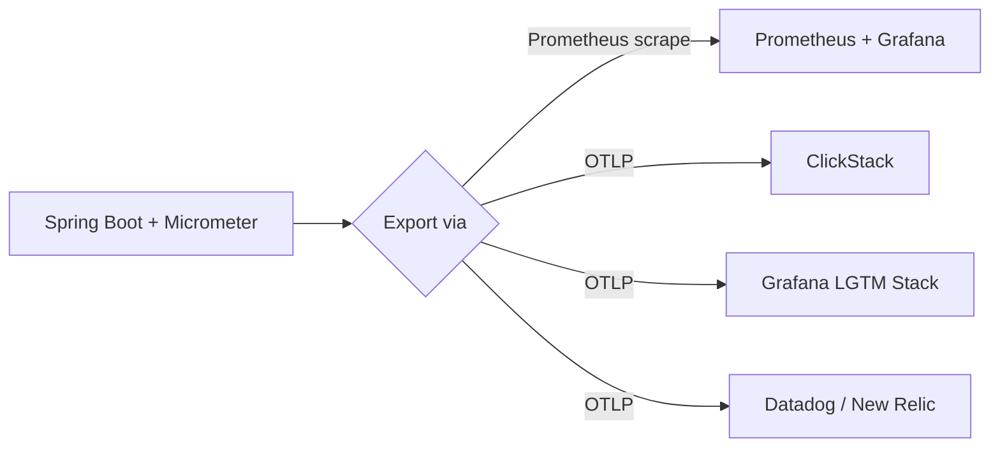

# Metrics — Spring Boot Actuator, OTel, and the Metrics Landscape

## Spring Boot Actuator

Actuator exposes operational endpoints: health, metrics, info, env. Add Prometheus integration to feed metrics to a monitoring system.

## Step 1: Add Dependencies

```xml
<dependency>
    <groupId>org.springframework.boot</groupId>
    <artifactId>spring-boot-starter-actuator</artifactId>
</dependency>
<dependency>
    <groupId>io.micrometer</groupId>
    <artifactId>micrometer-registry-prometheus</artifactId>
</dependency>
```

## Step 2: Expose Endpoints

```yaml
management:
  endpoints:
    web:
      exposure:
        include: health, info, metrics, prometheus
  endpoint:
    health:
      show-details: when-authorized
  metrics:
    tags:
      application: product-service
    export:
      prometheus:
        enabled: true
```

```bash
curl http://localhost:8080/actuator/prometheus
```

This endpoint returns metrics in Prometheus format. Prometheus scrapes it periodically.

## Step 3: Custom Metrics with @Timed

```java
@Service
@RequiredArgsConstructor
public class OrderService {
    private final OrderRepository repository;

    @Timed(value = "orders.create", description = "Time to create an order")
    public OrderResponse createOrder(OrderRequest request) {
        var order = new Order();
        order.setCustomerId(request.customerId());
        order.setItems(request.items());
        order.setTotal(calculateTotal(request.items()));
        var saved = repository.save(order);
        return toResponse(saved);
    }

    @Timed(value = "orders.list", description = "Time to list orders")
    public Page<OrderResponse> listOrders(Pageable pageable) {
        return repository.findAll(pageable).map(this::toResponse);
    }
}
```

`@Timed` automatically records:
- `orders.create.count` — number of invocations
- `orders.create.sum` — total time
- `orders.create.max` — maximum time
- `orders.create.percentile` — percentile distribution

## Step 4: Custom Metrics with MeterRegistry

```java
@Service
@RequiredArgsConstructor
public class PaymentService {
    private final MeterRegistry registry;
    private final PaymentGateway gateway;

    public PaymentResult process(PaymentRequest request) {
        var timer = registry.timer("payments.process",
            "method", request.method());
        return timer.record(() -> {
            var result = gateway.charge(request);
            registry.counter("payments.completed",
                "status", result.status(),
                "method", request.method()).increment();
            return result;
        });
    }
}
```

```java
@Component
@RequiredArgsConstructor
public class OrderMetrics {
    private final MeterRegistry registry;

    public void recordOrderCreated(BigDecimal amount, String category) {
        registry.counter("orders.created.total",
            "category", category).increment();
        registry.summary("orders.amount",
            "category", category).record(amount.doubleValue());
    }

    public void recordActiveOrders(int count) {
        registry.gauge("orders.active", count);
    }
}
```

## Step 5: The RED Method

Three metrics define service health:

| Metric | What It Measures | Alert On |
|--------|-----------------|----------|
| **Rate** | Requests per second | Sudden drops or spikes |
| **Errors** | Failed request rate | Error rate > 1% |
| **Duration** | Response time (p50, p95, p99) | p95 > SLO |

```java
@Configuration
public class MetricsConfig {
    @Bean
    public TimedAspect timedAspect(MeterRegistry registry) {
        return new TimedAspect(registry);
    }
}
```

## Step 6: Exporting Metrics via OpenTelemetry

Micrometer is a vendor-neutral abstraction. It already supports Prometheus, OTel, Datadog, and many others. To export via OpenTelemetry Protocol (OTLP) instead of Prometheus pull:

```xml
<dependency>
    <groupId>io.micrometer</groupId>
    <artifactId>micrometer-registry-otlp</artifactId>
</dependency>
```

```yaml
management:
  otlp:
    metrics:
      export:
        url: http://otel-collector:4318/v1/metrics
        step: 30s
```

Your application code (`@Timed`, `MeterRegistry`) does not change. Only the export configuration differs. This is the key benefit of OTel: **instrument once, send anywhere**.

## The Metrics Backend Landscape



| Stack | Type | Strengths | Tradeoffs |
|-------|------|-----------|-----------|
| **Prometheus + Grafana** | Self-hosted | Industry standard, huge community, PromQL | Separate system for logs/traces; storage needs management |
| **LGTM** (Loki+Grafana+Tempo+Mimir) | Self-hosted | Unified Grafana Labs stack for all 3 pillars | Complex to operate; 4 separate components |
| **ClickStack** | Self-hosted | Unified logs+traces+metrics in one ClickHouse, OTel-native, SQL queries | Newer project; smaller community |
| **Datadog** | SaaS | Turnkey, excellent UI, APM+logs+metrics in one | Expensive at scale; vendor lock-in |
| **New Relic** | SaaS | Generous free tier, good APM, OTel support | Cost grows with ingest; less flexible queries |

Decision framework:
- **Startup / side project**: New Relic free tier or ClickStack Docker
- **Team with ops capacity**: LGTM or Prometheus + Grafana
- **Enterprise with budget**: Datadog or New Relic
- **Cost-sensitive at scale**: ClickStack (ClickHouse storage is cheap)

## Worked Example: Prometheus + Grafana (Local)

```yaml
# docker-compose.yml
services:
  prometheus:
    image: prom/prometheus
    ports:
      - "9090:9090"
    volumes:
      - ./prometheus.yml:/etc/prometheus/prometheus.yml

  grafana:
    image: grafana/grafana
    ports:
      - "3000:3000"
```

```yaml
# prometheus.yml
scrape_configs:
  - job_name: product-service
    metrics_path: /actuator/prometheus
    scrape_interval: 15s
    static_configs:
      - targets: ['host.docker.internal:8080']
```

Key Grafana panels:

```
Request Rate:
  sum(rate(http_server_requests_seconds_count{uri!~".*actuator.*"}[5m])) by (uri, method)

Error Rate:
  sum(rate(http_server_requests_seconds_count{status=~"5.."}[5m]))
  / sum(rate(http_server_requests_seconds_count[5m]))

Latency P95:
  histogram_quantile(0.95, sum(rate(http_server_requests_seconds_bucket[5m])) by (le, uri))

JVM Memory:
  jvm_memory_used_bytes{area="heap"}

HikariCP Active Connections:
  hikaricp_connections_active
```

To switch to ClickStack, change the Micrometer registry to `micrometer-registry-otlp` and point the OTLP URL to the ClickStack OTel collector. Same application code.

## Key Points

- Actuator + Micrometer gives you metrics for free — JVM, HTTP, database connections
- Use `@Timed` on service methods to track business metrics
- Follow the RED method: Rate, Errors, Duration for every service
- OTel/OTLP makes your metrics vendor-neutral — change backend by changing config, not code
- Choose your backend based on team size, budget, and whether you want to manage infrastructure
