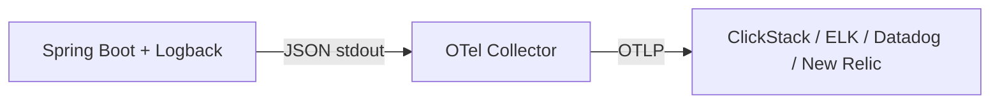

# Logging — Structured Logging, OTel, and the Logging Landscape

## Why Structured Logging

Plain text logs are hard to parse and search. JSON logs are machine-readable — log aggregation systems index every field for instant filtering.

```json
{"timestamp":"2024-01-15T10:30:00.123Z","level":"INFO","logger":"c.e.o.OrderService","message":"Order created","traceId":"abc123","orderId":42,"customerId":"C-100","duration":125}
```

## Step 1: Logback JSON Configuration

```xml
<!-- logback-spring.xml -->
<configuration>
    <springProperty scope="context" name="APP_NAME"
        source="spring.application.name" defaultValue="app"/>
    <springProperty scope="context" name="ENV"
        source="spring.profiles.active" defaultValue="dev"/>

    <appender name="JSON" class="ch.qos.logback.core.ConsoleAppender">
        <encoder class="net.logstash.logback.encoder.LogstashEncoder">
            <customFields>{
                "app":"${APP_NAME}",
                "env":"${ENV}"
            }</customFields>
            <includeMdc>true</includeMdc>
            <includeContext>true</includeContext>
        </encoder>
    </appender>

    <root level="INFO">
        <appender-ref ref="JSON"/>
    </root>

    <springProfile name="dev">
        <root level="DEBUG">
            <appender-ref ref="JSON"/>
        </root>
    </springProfile>
</configuration>
```

```xml
<dependency>
    <groupId>net.logstash.logback</groupId>
    <artifactId>logstash-logback-encoder</artifactId>
    <version>7.4</version>
</dependency>
```

## Step 2: Correlation IDs for Request Tracing

```java
@Component
public class CorrelationIdFilter extends OncePerRequestFilter {
    private static final String HEADER = "X-Correlation-ID";
    public static final String MDC_KEY = "correlationId";

    @Override
    protected void doFilterInternal(HttpServletRequest request,
            HttpServletResponse response, FilterChain chain)
            throws ServletException, IOException {
        var correlationId = request.getHeader(HEADER);
        if (correlationId == null || correlationId.isBlank()) {
            correlationId = UUID.randomUUID().toString();
        }
        MDC.put(MDC_KEY, correlationId);
        response.setHeader(HEADER, correlationId);
        try {
            chain.doFilter(request, response);
        } finally {
            MDC.remove(MDC_KEY);
        }
    }
}
```

MDC (Mapped Diagnostic Context) attaches the correlation ID to every log line in the request thread. The JSON encoder includes MDC fields automatically.

## Step 3: Structured Logging in Code

```java
@Service
@RequiredArgsConstructor
@Slf4j
public class OrderService {
    private final OrderRepository repository;

    public OrderResponse createOrder(OrderRequest request) {
        var start = Instant.now();
        var order = new Order();
        order.setCustomerId(request.customerId());
        order.setItems(request.items());
        var saved = repository.save(order);

        log.info("Order created orderId={} customerId={} itemCount={} duration={}ms",
            saved.getId(),
            saved.getCustomerId(),
            saved.getItems().size(),
            Duration.between(start, Instant.now()).toMillis());

        return toResponse(saved);
    }

    public OrderResponse getOrder(Long id) {
        log.debug("Fetching order orderId={}", id);
        return repository.findById(id)
            .map(this::toResponse)
            .orElseThrow(() -> {
                log.warn("Order not found orderId={}", id);
                return new ResourceNotFoundException("Order not found");
            });
    }
}
```

Key=value pairs in log messages are parsed as structured fields by most log aggregation systems.

## Step 4: Log Levels in Production

| Level | When to Use |
|-------|-------------|
| ERROR | Unrecoverable failures requiring immediate attention |
| WARN | Recoverable issues, degraded behavior |
| INFO | Business events (order created, payment processed) |
| DEBUG | Technical details for troubleshooting |
| TRACE | Very verbose (SQL queries, HTTP bodies) |

```yaml
# application-prod.yml
logging:
  level:
    root: WARN
    com.example: INFO
    org.springframework.web: WARN
    org.hibernate.SQL: WARN
```

## Step 5: Shipping Logs via OpenTelemetry

Your app emits structured JSON logs. The question is: where do they go? OpenTelemetry provides a vendor-neutral pipeline.

> **Diagram:** Spring Boot with Logback emits JSON logs to stdout, which are collected by the OTel Collector and forwarded via OTLP to backends like ClickStack, ELK, Datadog, or New Relic.



The OTel Collector reads logs from your application (file tailing, stdout, or direct OTLP export) and forwards them to any backend. Your Logback configuration stays the same regardless of backend.

```yaml
# OTel Collector config — filelog receiver + OTLP export
receivers:
  filelog:
    include: [/var/log/app/*.log]
    parsers:
      json:
        timestamp_key: timestamp
        severity_key: level

exporters:
  otlp:
    endpoint: clickstack:4317
    tls:
      insecure: true

service:
  pipelines:
    logs:
      receivers: [filelog]
      exporters: [otlp]
```

Change the `endpoint` to point at Datadog, New Relic, or an OTLP-compatible ELK setup. Same collector config, different endpoint.

## The Logging Backend Landscape

| Stack | Type | Strengths | Tradeoffs |
|-------|------|-----------|-----------|
| **ELK** (Elasticsearch+Logstash+Kibana) | Self-hosted | Mature, huge ecosystem, powerful full-text search | Resource-heavy; Elasticsearch needs tuning at scale |
| **Grafana Loki** | Self-hosted | Lightweight, indexes labels only (not full text), cheap to run | Query power limited vs Elasticsearch; not a drop-in replacement |
| **ClickStack** | Self-hosted | Unified with traces+metrics, SQL queries on logs, ClickHouse is fast at scale | Newer; smaller community than ELK |
| **Datadog Log Management** | SaaS | Turnkey, powerful search, correlates with APM traces | Expensive per GB ingested |
| **New Relic Logging** | SaaS | Generous free tier, NRQL queries, OTel-native ingest | Cost grows with volume |

Decision framework:
- **Already running Elasticsearch**: ELK — don't add another system
- **Want cheapest self-hosted**: Loki — indexes labels, not full text, runs on minimal resources
- **Want unified logs+traces+metrics**: ClickStack — one backend for everything
- **No ops team, need it now**: Datadog or New Relic — pay and go

## Worked Example: ClickStack (Docker Compose)

```yaml
# docker-compose.yml
services:
  clickstack:
    image: docker.hyperdx.io/hyperdx/hyperdx-all-in-one
    ports:
      - "8080:8080"
      - "4317:4317"
      - "4318:4318"

  otel-collector:
    image: otel/opentelemetry-collector-contrib
    volumes:
      - ./otel-collector-config.yaml:/etc/otelcol/config.yaml
    depends_on:
      - clickstack
```

```yaml
# otel-collector-config.yaml
receivers:
  filelog:
    include: [/var/log/app/*.log]
    parsers:
      json:

exporters:
  otlp:
    endpoint: clickstack:4317
    tls:
      insecure: true

service:
  pipelines:
    logs:
      receivers: [filelog]
      exporters: [otlp]
```

Navigate to `http://localhost:8080` to search logs with Lucene-style queries (`level:err`) or SQL. Correlation IDs link log lines to traces automatically.

To switch to Datadog, replace the OTLP exporter with:

```yaml
exporters:
  datadog:
    api:
      key: ${DD_API_KEY}
```

Same Logback config, same structured logging. Only the collector exporter changes.

## Key Points

- Use JSON logging in production — searchable, filterable, aggregatable
- Correlation IDs (in MDC) link all log lines for a single request
- Log business events at INFO, technical details at DEBUG
- OTel Collector is the pipe — your app doesn't know or care where logs end up
- Choose backend by team size and budget: ELK for maturity, Loki for cheap, ClickStack for unified, SaaS for zero ops
