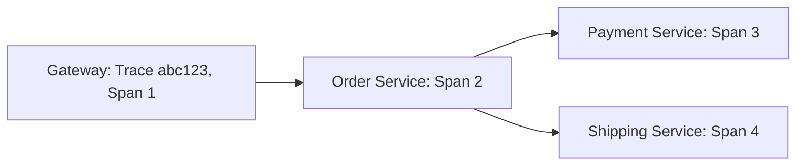
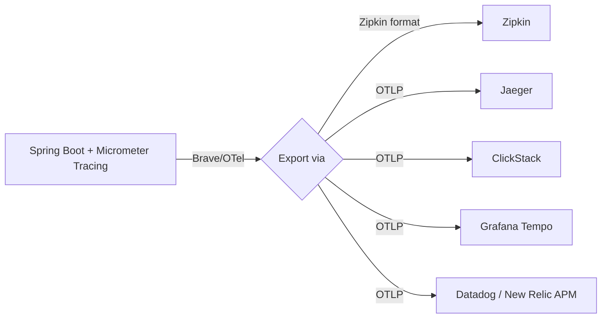

# Tracing — Distributed Tracing, OTel, and the Tracing Landscape

## The Problem

A request hits your API gateway, calls the order service, which calls the payment service, which calls the shipping service. When latency spikes, which service is slow? Without distributed tracing, you guess.

## How Tracing Works



- **Trace ID**: Unique identifier for the entire request across all services
- **Span ID**: Unique identifier for each operation within the trace
- **Propagation**: Services pass the trace ID via HTTP headers

## Step 1: Add Tracing Dependencies

```xml
<dependency>
    <groupId>io.micrometer</groupId>
    <artifactId>micrometer-tracing-bridge-brave</artifactId>
</dependency>
<dependency>
    <groupId>io.zipkin.reporter2</groupId>
    <artifactId>zipkin-reporter-brave</artifactId>
</dependency>
```

```yaml
management:
  tracing:
    sampling:
      probability: 1.0
  zipkin:
    tracing:
      endpoint: http://zipkin:9411/api/v2/spans
```

`probability: 1.0` means trace every request. In production, sample 10% (`0.1`) to reduce overhead.

For OTel-native tracing (recommended for new projects), use the OTLP exporter instead:

```xml
<dependency>
    <groupId>io.micrometer</groupId>
    <artifactId>micrometer-tracing-bridge-otel</artifactId>
</dependency>
<dependency>
    <groupId>io.opentelemetry</groupId>
    <artifactId>opentelemetry-exporter-otlp</artifactId>
</dependency>
```

```yaml
management:
  tracing:
    sampling:
      probability: 1.0
  otlp:
    tracing:
      endpoint: http://otel-collector:4318/v1/traces
```

Same Spring Boot tracing API. Different bridge + exporter. The application code does not change.

## Step 2: Trace Propagation

Spring Boot propagates trace IDs automatically via HTTP headers (`traceparent`, `tracestate`). No code needed for basic propagation — it works out of the box with RestTemplate, WebClient, and Feign clients.

```java
@Configuration
public class TracingConfig {
    @Bean
    public RestClient tracingRestClient(RestClient.Builder builder) {
        return builder
            .baseUrl("http://payment-service:8082")
            .build();
    }
}
```

## Step 3: Manual Span Creation

```java
@Service
@RequiredArgsConstructor
public class OrderService {
    private final Tracer tracer;
    private final PaymentClient paymentClient;
    private final OrderRepository repository;

    public OrderResponse createOrder(OrderRequest request) {
        var span = tracer.nextSpan().name("validate-order").start();
        try (Tracer.SpanInScope ws = tracer.withSpan(span)) {
            validate(request);
            span.tag("order.customerId", request.customerId());
            span.tag("order.itemCount",
                String.valueOf(request.items().size()));
        } finally {
            span.end();
        }

        var order = saveOrder(request);
        paymentClient.processPayment(order);
        return toResponse(order);
    }

    public void annotateSpan(String key, String value) {
        var currentSpan = tracer.currentSpan();
        if (currentSpan != null) {
            currentSpan.tag(key, value);
            currentSpan.event("custom-event-at-" + Instant.now());
        }
    }
}
```

Manual spans add business context: what was ordered, how many items, which customer. This makes traces searchable and meaningful.

## Step 4: Tracing Across Three Services

```
Request flow:
  API Gateway (Span: GET /api/orders)
    → Order Service (Span: POST /api/orders)
      → Payment Service (Span: POST /api/payments)
        → Payment Gateway (Span: external API call)
      → Shipping Service (Span: POST /api/shipments)
```

Each service creates a child span. The tracing backend visualizes the waterfall:

```
Gateway        [====]
Order Service     [========]
Payment              [====]
External               [==]
Shipping             [===]
```

The visualization immediately shows which service is slow.

## Step 5: Log-Trace Correlation

Correlation IDs in logs match trace IDs. With structured logging:

```json
{
  "timestamp": "2024-01-15T10:30:00Z",
  "level": "INFO",
  "message": "Order created",
  "traceId": "abc123def456",
  "spanId": "span789",
  "orderId": 42
}
```

Search logs by `traceId` to see every log line for a specific request across all services.

## The Tracing Backend Landscape



| Tool | Type | Strengths | Tradeoffs |
|------|------|-----------|-----------|
| **Zipkin** | Self-hosted | Simple, lightweight, great for dev/testing | Not designed for production scale |
| **Jaeger** | Self-hosted | Production-grade, CNCF graduated, OTel-native | Needs Elasticsearch/Cassandra for storage at scale |
| **Grafana Tempo** | Self-hosted | Cheap storage (object store), integrates with Grafana/Loki | Query requires trace ID (no full search without TraceQL) |
| **ClickStack** | Self-hosted | Unified with logs+metrics, SQL on traces, one backend | Newer; smaller community |
| **Datadog APM** | SaaS | Best-in-class UI, auto-instrumentation, correlates logs+traces+metrics | Expensive per host; vendor lock-in |
| **New Relic APM** | SaaS | Good free tier, distributed tracing, OTel ingest | Deep queries need NRQL learning |

Decision framework:
- **Just trying tracing out**: Zipkin (simplest Docker setup)
- **Production self-hosted, already using Grafana**: Tempo + Loki
- **Want unified observability**: ClickStack (one backend for everything)
- **Production SaaS, budget available**: Datadog or New Relic

## Worked Example: ClickStack (Docker Compose)

```yaml
# docker-compose.yml
services:
  clickstack:
    image: docker.hyperdx.io/hyperdx/hyperdx-all-in-one
    ports:
      - "8080:8080"
      - "4317:4317"
      - "4318:4318"
```

Navigate to `http://localhost:8080` to explore traces. Search by service, endpoint, latency, or trace ID.

To switch to Jaeger, change the OTLP endpoint:

```yaml
management:
  otlp:
    tracing:
      endpoint: http://jaeger:4318/v1/traces
```

Same application code. Same manual spans. Different endpoint.

## Key Points

- Distributed tracing shows exactly where latency lives across services
- Spring Boot propagates trace IDs automatically — no custom header handling
- Add manual spans for business context (order ID, customer ID)
- Sample traces in production (10%) — 100% sampling has overhead
- OTel is the standard — instrument once, send to any backend
- Choose backend by scale and budget: Zipkin for dev, Jaeger/Tempo for production, ClickStack for unified, SaaS for zero ops
