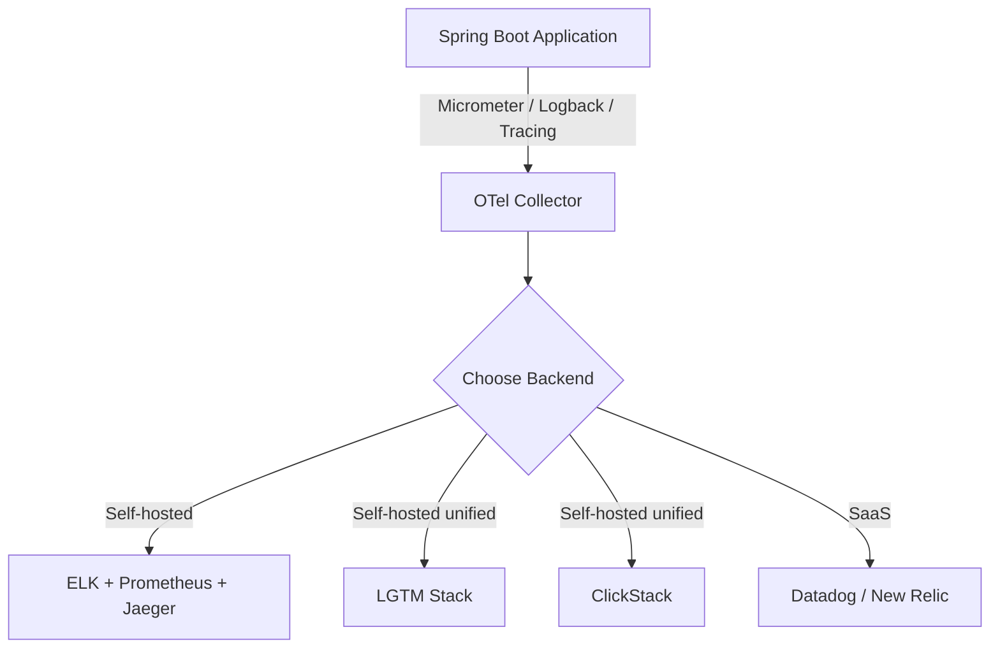

# Observability Strategy — The Three Pillars and the OTel Landscape

## The Three Pillars

| Pillar | Answers | Example |
|--------|---------|---------|
| Metrics | "How many? How fast? How often?" | Error rate, latency p95, throughput |
| Logs | "What happened? What went wrong?" | Stack traces, business events |
| Traces | "Where is it slow? What called what?" | Service waterfall, span durations |

Each pillar alone is insufficient. Together they give you complete visibility.

## What to Monitor First

Start with what affects users, not infrastructure.

### Layer 1: User-Facing Metrics (Day 1)

```java
@Configuration
public class ObservabilityConfig {
    @Bean
    public TimedAspect timedAspect(MeterRegistry registry) {
        return new TimedAspect(registry);
    }
}
```

```
- HTTP error rate (5xx) — are users seeing failures?
- Request latency (p95, p99) — is the app slow?
- Throughput (requests/sec) — can we handle the load?
```

### Layer 2: Business Metrics (Week 1)

```java
@Service
@RequiredArgsConstructor
public class OrderService {
    private final MeterRegistry registry;

    public OrderResponse createOrder(OrderRequest request) {
        var order = process(request);
        registry.counter("orders.created",
            "category", order.getCategory()).increment();
        return toResponse(order);
    }
}
```

```
- Orders created per minute
- Payment success rate
- Active users
```

### Layer 3: Infrastructure Metrics (Week 2)

```
- JVM heap usage, GC pauses
- Database connection pool utilization
- Thread pool saturation
- Disk, CPU, memory at the host level
```

## Alerting Strategy

### Alert on Symptoms, Not Causes

```
BAD:  Alert on "CPU > 80%"
GOOD: Alert on "p95 latency > 500ms for 5 minutes"
```

CPU might be high because of a legitimate traffic spike. Latency affects users directly.

### Alert Severity

| Level | Response Time | Example |
|-------|---------------|---------|
| Critical | Immediate (page) | Error rate > 5%, service down |
| Warning | Within 1 hour | p95 latency > 2x normal |
| Info | Next business day | Deploy completed, scale event |

### Practical Alerts

```yaml
groups:
  - name: product-service
    rules:
      - alert: HighErrorRate
        expr: rate(http_server_requests_seconds_count{status=~"5.."}[5m]) / rate(http_server_requests_seconds_count[5m]) > 0.05
        for: 5m
        labels:
          severity: critical
        annotations:
          summary: "Error rate above 5% for 5 minutes"

      - alert: HighLatency
        expr: histogram_quantile(0.95, rate(http_server_requests_seconds_bucket[5m])) > 0.5
        for: 5m
        labels:
          severity: warning
        annotations:
          summary: "p95 latency above 500ms"

      - alert: DatabasePoolExhaustion
        expr: hikaricp_connections_active / hikaricp_connections_max > 0.9
        for: 3m
        labels:
          severity: critical
```

## SLOs and Error Budgets

An SLO (Service Level Objective) is a reliability target. Example: "99.9% of requests complete in under 500ms."

```
Error budget = 1 - SLO
99.9% SLO → 0.1% error budget per month = 43.2 minutes of downtime allowed
```

If you've burned your error budget by mid-month, freeze deployments and focus on reliability.

## Runbooks

Every alert needs a runbook — a document that explains:

1. What the alert means
2. How to verify the issue
3. Steps to fix it
4. Who to escalate to

```markdown
# Runbook: HighErrorRate

## What: Error rate above 5% for 5 minutes
## Verify: Check /actuator/health and recent deployments
## Fix:
  1. Check recent deployment: kubectl rollout history deployment/product-service
  2. If new deployment, rollback: kubectl rollout undo deployment/product-service
  3. Check downstream services: /actuator/health on payment-service
  4. Check database connectivity: /actuator/health/db
## Escalate: #platform-engineering Slack channel
```

## The Observability Stack Landscape

> **Diagram:** Spring Boot application sends telemetry via Micrometer, Logback, and Tracing to an OTel Collector, which can export to ELK, LGTM Stack, ClickStack, or SaaS backends like Datadog/New Relic.



### Option 1: Traditional Separate Stack (ELK + Prometheus + Jaeger)

```
Metrics:  Spring Boot → Micrometer → Prometheus → Grafana
Logs:     Spring Boot → Logback → Logstash → Elasticsearch → Kibana
Traces:   Spring Boot → Micrometer Tracing → Jaeger
```

Three separate systems to deploy, configure, and maintain. Each is mature and battle-tested. Correlation between pillars requires manual trace ID lookups. ELK is widely used in Thai enterprises.

### Option 2: Grafana LGTM Stack (Loki + Grafana + Tempo + Mimir)

```
Metrics:  Spring Boot → OTLP → Mimir → Grafana
Logs:     Spring Boot → OTLP → Loki → Grafana
Traces:   Spring Boot → OTLP → Tempo → Grafana
```

One UI (Grafana) for all three pillars. Each backend is purpose-built and efficient. More components to operate, but Grafana Cloud offers managed versions.

### Option 3: ClickStack (ClickHouse + HyperDX + OTel Collector)

```
All:  Spring Boot → OTLP → ClickStack (logs + traces + metrics in one ClickHouse)
```

One backend for everything. SQL queries across all telemetry types. ClickHouse columnar storage handles high-cardinality, high-volume data cheaply. OTel-native. Newer but actively developed by ClickHouse Inc.

### Option 4: SaaS (Datadog / New Relic)

```
All:  Spring Boot → OTLP → Datadog / New Relic
```

Zero infrastructure. Correlates logs, traces, metrics, and real-user monitoring automatically. Best-in-class UIs. Expensive at scale (pay per GB ingested per host). Good for teams without dedicated ops.

### Decision Framework

| Situation | Pick |
|-----------|------|
| Startup, small team, no ops | New Relic free tier or ClickStack Docker |
| Thai enterprise, already has ELK | Keep ELK, add Prometheus + Jaeger alongside |
| Team using Grafana for everything | LGTM stack |
| Want one backend, cost-sensitive at scale | ClickStack |
| Budget available, want zero ops | Datadog |

### The Key Principle: OTel Makes This a Config Change

All four options receive data via the same OpenTelemetry pipeline. Your Spring Boot application code (`@Timed`, structured logging, `Tracer`) does not change when you switch backends. Only the OTel Collector exporter endpoint changes:

```yaml
# ClickStack
exporters:
  otlp:
    endpoint: clickstack:4317

# Datadog
exporters:
  datadog:
    api:
      key: ${DD_API_KEY}

# New Relic
exporters:
  otlp:
    endpoint: otlp.nr-data.net:4317
    headers:
      api-key: ${NEW_RELIC_LICENSE_KEY}
```

Instrument once. Change the endpoint. This is why OTel is the standard.

## Key Points

- Start with user-facing metrics: error rate, latency, throughput
- Alert on symptoms (latency, errors) not causes (CPU, disk)
- Define SLOs and track error budgets
- Write runbooks for every alert — during an incident is too late
- OTel is the pipe — your application code is backend-agnostic
- Choose your stack based on team size, budget, and ops capacity, not technical superiority
